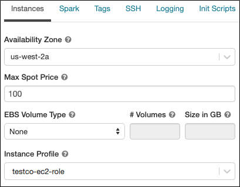
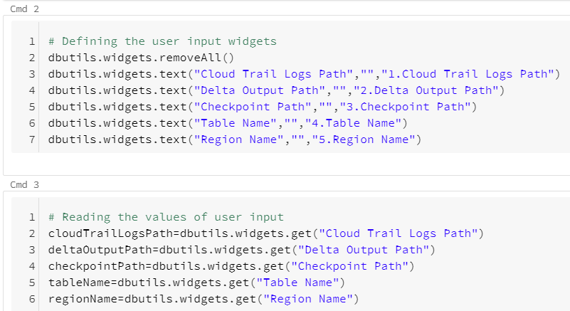

# Ingesting AWS CloudTrail Logs Into Databricks

**User Guide 1.0.0**

Note:

This document is produced by Databricks as a reference. Databricks makes no warranties or guarantees. Information contained within may not be the most up-to-date available. Information in this document is subject to change without notice. Databricks shall not be liable for any damages resulting from technical errors or omissions that may be present in this document, or from use of this document.

Databricks and the Databricks logo are trademarks or service marks of Databricks, Inc. in the US and other countries. Microsoft Azure and Azure are trademarks of Microsoft Inc. Azure Databricks is a product provided by Microsoft, please see their website for additional information. All other trademarks within this document are property of their respective companies. Copyright 2020 Databricks, Inc. For more information, visit [http://www.databricks.com](http://www.databricks.com/).

Technical documentation and support materials include details based on the full set of capabilities and features of a specific release. Access to some functionality requires specific license types (tiers).

# 
# Contents
* [Overview](#Overview)
* [CloudTrail To S3](#CloudTrail%20To%20S3)
  * [CloudTrail Event Types](#CloudTrail%20Event%20Types)
    * [Management Events](#Management%20Events)
    * [Data Events](#Data%20Events)
    * [Insights Events](#Insights%20Events)
  * [Creating a Trail For Your AWS Account](#Creating%20a%20Trail%20For%20Your%20AWS%20Account)
  * [Receiving CloudTrail Log Files from Multiple Accounts](#Receiving%20CloudTrail%20Log%20Files%20from%20Multiple%20Accounts)
  * [Example logs](#Example%20logs)
* [S3 To Databricks](#S3%20To%20Databricks)
  * [Requirements](#Requirements)
  * [Secure Access To S3 buckets Using Instance Profiles](#Secure%20Access%20To%20S3%20buckets%20Using%20Instance%20Profiles)
  * [Configuring AWS to allow use of "useNotifications=true" in Notebook](#Configuring%20AWS%20to%20allow%20use%20of%20"useNotifications=true"%20in%20Notebook)
  * [CloudTrail Logs Notebooks](#CloudTrail%20Logs%20Notebooks)
  * [Troubleshooting](#Troubleshooting)
* [References](#References)

 
# Overview

This document provides information on how to get your AWS CloudTrail logs into Databricks Delta table using Databricks Autoloader.

 
# CloudTrail To S3

AWS **CloudTrail** is a service that enables governance, compliance, operational auditing, and risk auditing of your AWS account. With CloudTrail, you can log, continuously monitor, and retain account activity related to actions across your AWS infrastructure. CloudTrail provides event history of your AWS account activity, including actions taken through the AWS Management Console, AWS SDKs, command-line tools, and other AWS services. This event history simplifies security analysis, resource change tracking, and troubleshooting. Also, you can use CloudTrail to detect unusual activity in your AWS accounts. These capabilities help simplify operational analysis and troubleshooting. IAM is integrated with AWS CloudTrail.

CloudTrail is enabled on your AWS account when you create it. When activity occurs in your AWS account, that activity is recorded in a CloudTrail event. You can easily view events in the CloudTrail console by going to Event history. Event history allows you to view, search, and download the past 90 days of activity in your AWS account.

## CloudTrail Event Types

There are various types of events that can be logged in CloudTrail as mentioned below.

### Management Events

**Management events** provide information about management operations that are performed on resources in your AWS account. These are also known as control plane operations. Example of management events include:

* Configuring security (for example, IAM `CreateUser` operations).
* Registering devices (for example, Amazon EC2 `CreateDefaultVpc` API operations).
* Configuring rules for routing data (for example, Amazon EC2 `DescribeSubnet` API operations).
* Setting up logging (for example, AWS CloudTrail `CreateTrail` API operations).

### Data Events

**Data events** provide information about the resource operations performed on or in a resource. These are also known as data plane operations. Data events are often high-volume activities.

The following data types are recorded:

* Amazon S3 object-level API activity (for example, `GetObject`, `DeleteObject`, and `PutObject` API operations).
* AWS Lambda function execution activity (the Invoke API).

### Insights Events

CloudTrail **Insights events** capture unusual activity in your AWS account. If you have Insights events enabled, and CloudTrail detects unusual activity, Insights events are logged to a different folder or prefix in the destination S3 bucket for your trail.

## Creating a Trail For Your AWS Account

To create a CloudTrail trail with the AWS Management Console

1. Sign in to the AWS Management Console and open the CloudTrail console at [https://console.aws.amazon.com/cloudtrail/](https://console.aws.amazon.com/cloudtrail/).
2. On the CloudTrail service home page, the Trails page, or the Trails section of the Dashboard page, choose Create trail.
3. On the Create Trail page, for Trail name, type a name for your trail. For more information, see [CloudTrail Trail Naming Requirements](https://docs.aws.amazon.com/awscloudtrail/latest/userguide/cloudtrail-trail-naming-requirements.html).
4. If this is an AWS Organizations organization trail, you can choose to enable the trail for all accounts in your organization. You only see this option if you are signed in to the console with an IAM user or role in the master account. To successfully create an organization trail, be sure that the user or role has [sufficient permissions](https://docs.aws.amazon.com/awscloudtrail/latest/userguide/creating-an-organizational-trail-prepare.html#org_trail_permissions). For more information, see [Creating a Trail for an Organization](https://docs.aws.amazon.com/awscloudtrail/latest/userguide/creating-trail-organization.html).
5. For **Storage location**, choose Create new S3 bucket to create a bucket. When you create a bucket, CloudTrail creates and applies the required bucket policies or you can choose to use the existing S3 bucket by clicking on specify a bucket in Trail log bucket name, or choose Browse to choose a bucket.
 To make it easier to find your logs, create a new folder (also known as a prefix) in an existing bucket to store your CloudTrail logs. Enter the prefix in Prefix.
6. For **Logfile SSE-KMS encryption**, choose Enabled if you want to encrypt your log files with SSE-KMS instead of SSE-S3. The default is Enabled. For more information about this encryption type, see [Protecting Data Using Server-Side Encryption with Amazon S3-Managed Encryption Keys (SSE-S3)](https://docs.aws.amazon.com/AmazonS3/latest/dev/UsingServerSideEncryption.html).
7. In **Additional settings**, configure the following.
    1. For Logfile validation, choose Enabled to have log digests delivered to your S3 bucket. You can use the digest files to verify that your log files did not change after CloudTrail delivered them. For more information, see [Validating CloudTrail Log File Integrity](https://docs.aws.amazon.com/awscloudtrail/latest/userguide/cloudtrail-log-file-validation-intro.html).
    2. For SNS notification delivery, choose Enabled to be notified each time a log is delivered to your bucket. CloudTrail stores multiple events in a log file. SNS notifications are sent for every log file, not for every event. For more information, see [Configuring Amazon SNS Notifications for CloudTrail](https://docs.aws.amazon.com/awscloudtrail/latest/userguide/configure-sns-notifications-for-cloudtrail.html).
8. (Optional) For **Tags**, add one or more custom tags (key-value pairs) to your trail. Tags can help you identify both your CloudTrail trails and the Amazon S3 buckets that contain CloudTrail log files. You can then use resource groups for your CloudTrail resources. For more information, see [AWS Resource Groups](https://docs.aws.amazon.com/ARG/latest/userguide/welcome.html) and [Why Use Tags For Trails?](https://docs.aws.amazon.com/awscloudtrail/latest/userguide/cloudtrail-concepts.html#cloudtrail-concepts-tags).
9. On the **Choose log events** page, choose the event types that you want to log. By default, Management events are selected.
10. For **Management events**, do the following.
    1. For API activity, choose if you want your trail to log Read events, Write events, or both. By default, trails log all management events. For more information, see [Management Events](https://docs.aws.amazon.com/awscloudtrail/latest/userguide/logging-management-events-with-cloudtrail.html#logging-management-events).
    2. Choose Exclude AWS KMS events to filter AWS Key Management Service (AWS KMS) events out of your trail. The default setting is to include all AWS KMS events.
11. For **Data events**, you can specify logging data events for Amazon S3 buckets, for AWS Lambda functions, or both. By default, trails don&#39;t log data events. Additional charges apply for logging data events. For more information, see [Data Events](https://docs.aws.amazon.com/awscloudtrail/latest/userguide/logging-data-events-with-cloudtrail.html#logging-data-events). For CloudTrail pricing, see [AWS CloudTrail Pricing](https://aws.amazon.com/cloudtrail/pricing/).

    For Amazon S3 buckets:

    1. For Data event source, choose S3.
    2. You can choose to log All current and future S3 buckets, or you can specify individual buckets or functions. By default, data events are logged for all current and future S3 buckets.
    3. If you leave the default, All current and future S3 buckets, choose to log Read events, Write events, or both.
    4. To select individual buckets, empty the Read and Write checkboxes for All current and future S3 buckets. In Individual bucket selection, browse for a bucket on which to log data events. Filter a large number of buckets by typing a bucket prefix for the bucket you want. You can select multiple buckets in this window. Choose Add bucket to log data events for more buckets. Choose to log Read events, such as GetObject, Write events, such as PutObject, or both.

        This setting takes precedence over individual settings you configure for individual buckets. For example, if you specify logging Read events for all S3 buckets, and then choose to add a specific bucket for data event logging, Read is already selected for the bucket you added. You cannot clear the selection. You can only configure the option for Write.

        To remove a bucket from logging, choose X.

12. To add another data type on which to log data events, choose Add data event type.
13. For Lambda functions:
    1. For Data event source, choose Lambda.
    2. In the Lambda function, choose All regions to log all Lambda functions, or Input functions as ARN to log data events on a specific function.
 To log data events for all Lambda functions in your AWS account, select Log all current and future functions. This setting takes precedence over individual settings you configure for individual functions. All functions are logged, even if all functions are not displayed.
    3. If you choose Input function as ARN, type the ARN of a Lambda function.

    For more information, see [Managing Trails With the AWS CLI](https://docs.aws.amazon.com/awscloudtrail/latest/userguide/cloudtrail-additional-cli-commands.html).
14. Choose **Insights events** if you want your trail to log CloudTrail Insights events.
 In Event type, select Insights events. You must be logging Write management events to log Insights events. Insights events are delivered to a different folder named /CloudTrail-Insight of the same S3 bucket that is specified in the Storage location area of the trail details page. CloudTrail creates the new prefix for you. For example, if your current destination S3 bucket is named S3bucketName/AWSLogs/CloudTrail/, the S3 bucket name with a new prefix is named S3bucketName/AWSLogs/CloudTrail-Insight/.
15. When you are finished choosing event types to log, choose Next.
16. On the Review and create page, review your choices. Choose Edit in a section to change the trail settings shown in that section. When you are ready to create the trail, choose Create trail.
17. The new trail appears on the Trails page. The Trails page shows the trails in your account from all Regions. In about 15 minutes, CloudTrail publishes log files that show the AWS API calls made in your account. You can see the log files in the S3 bucket that you specified. It can take up to 36 hours for CloudTrail to deliver the first Insights event, if you have enabled Insights event logging, and unusual activity is detected.

## Receiving CloudTrail Log Files from Multiple Accounts

You can have CloudTrail deliver log files from multiple AWS accounts into a single Amazon S3 bucket. For example, you have four AWS accounts with account IDs 1, 2, 3, and 4, and you want to configure CloudTrail to deliver log files from all four of these accounts to a bucket belonging to account 1. To accomplish this, complete the following steps in order:

1. Turn on CloudTrail in the account where the destination bucket will belong (1 in this example). Do not turn on CloudTrail in any other accounts yet.
2. Update the bucket policy on your destination bucket to grant cross-account permissions to CloudTrail. To modify bucket permissions so that files can be received from multiple accounts
    1. Sign in to the AWS Management Console using the account that owns the bucket (1 in this example) and open the Amazon S3 console.
    2. Choose the bucket where CloudTrail delivers your log files and then choose **Properties**.
    3. Choose **Permissions**.
    4. Choose **Edit Bucket Policy**.
    5. Modify the existing policy to add a line for each additional account whose log files you want delivered to this bucket. See the following example policy and note the underlined Resource line specifying a second account ID.

        ```json
        {
        "Version": "2012-10-17",
        "Statement": [
            {
            "Sid": "AWSCloudTrailAclCheck20131101",
            "Effect": "Allow",
            "Principal": {
                "Service": "cloudtrail.amazonaws.com"
            },
            "Action": "s3:GetBucketAcl",
            "Resource": "arn:aws:s3:::myBucketName"
            },
            {
            "Sid": "AWSCloudTrailWrite20131101",
            "Effect": "Allow",
            "Principal": {
                "Service": "cloudtrail.amazonaws.com"
            },
            "Action": "s3:PutObject",
            "Resource": [
                "arn:aws:s3:::myBucketName/[optional] myLogFilePrefix/AWSLogs/{AccountID for account1}/*",
                "arn:aws:s3:::myBucketName/[optional] myLogFilePrefix/AWSLogs/{AccountID for account2}/*"
            ],
            "Condition": {
                "StringEquals": {
                "s3:x-amz-acl": "bucket-owner-full-control"
                }
            }
            }
        ]
        }
        ```

Turn on CloudTrail in the other accounts you want (2, 3, and 4 in this example). Configure CloudTrail in these accounts to use the same bucket belonging to the account that you specified in step 1 (1 in this example).

## Example logs

[CloudTrail Example Logs](https://docs.google.com/document/d/1pwnnvX2N5m04kTAwnvp2nrCTJRW3LMq8CMETna7NYew/edit?usp=sharing)

# 
# S3 To Databricks

To ingest data from AWS S3 bucket to Databricks, Databricks Auto Loader is being used in the Notebook. Auto Loader incrementally and efficiently processes new data files as they arrive in S3 bucket. It provides a Structured Streaming source called cloudFiles. Given an input directory path on the cloud file storage, the cloudFiles source automatically processes new files as they arrive, with the option of also processing existing files in that directory.

## Requirements

1. Databricks Runtime 7.3 or above
2. AWS administrator access to IAM roles and policies in the AWS account of the Databricks deployment and the AWS account of the S3 bucket.
3. The target S3 bucket must belong to the same AWS account as the Databricks deployment.

For proper functioning of the notebook to get data from S3 buckets to Databricks,we need to provide secure access to the S3 buckets using Instance profiles and configure AWS to allow use of "useNotifications=true" in Notebook. Follow the steps below to provide the required access to the notebook.

## Secure Access To S3 buckets Using Instance Profiles

An **IAM role** is an IAM identity with permission policies that determine what the identity can and cannot do in AWS. However, instead of being uniquely associated with one person, a role is intended to be assumable by anyone who needs it.

An **instance profile** is a container for an IAM role that you can use to pass the role information to an EC2 instance when the instance starts.

Secure access using **IAM roles and instance profiles are required** when you want to give access to use AWS resources but don&#39;t want to embed AWS keys within the app (where they can be difficult to rotate and where users can potentially extract them).

To access AWS resources securely, you can launch Databricks clusters with instance profiles that allow you to access your data from Databricks clusters without having to embed your AWS keys in notebooks.

Follow the below steps to securely access S3 bucket using instance profiles:

1. Create an instance profile to access S3 bucket
    - In the AWS console, go to the ***IAM service.***
    - Click the ***Roles*** tab in the sidebar.
    - Click ***Create role***.
        - Under ***Select type of trusted entity***, select ***AWS service.***
        - Under ***Choose the service that will use this role***, select ***EC2***.
            
            
            
        - Click ***Next: Permissions, Next: Tags***, and ***Next: Review.***
        - In the **Role name** field, type a role name.
        - Click ***Create role***. The list of roles displays.
        
    - In the role list, click the role.
    - Add an inline policy to the role. This policy grants access to the S3 bucket.
        - In the Permissions tab, click ***Add Inline policy***.
        - Click the ***JSON*** tab.
        - Copy this policy and set _\<s3-bucket-name\>_ to the name of your bucket.
        
            ```json
            {
            "Version": "2012-10-17",
            "Statement": [
                {
                "Effect": "Allow",
                "Action": [
                    "s3:ListBucket"
                ],
                "Resource": [
                    "arn:aws:s3:::<s3-bucket-name>"
                ]
                },
                {
                "Effect": "Allow",
                "Action": [
                    "s3:PutObject",
                    "s3:GetObject",
                    "s3:DeleteObject",
                    "s3:PutObjectAcl"
                ],
                "Resource": [
                    "arn:aws:s3:::<s3-bucket-name>/*"
                ]
                }
            ]
            }
            ```
        - Click ***Review policy***.
        - In the ***Name*** field, type a policy name.
        - Click ***Create policy***.
    - From the role summary displayed, copy the ***Instance Profile ARN***.
2. Create a bucket policy for the target S3 bucket that grants the required permissions to the target bucket.
    - In the AWS console, go to the **S3 service.**
    - From the list select your target S3 bucket.
    - In the **permissions tab** go to **Bucket Policy**.
    - Modify the policy to ensure that the S3 bucket has all the required permissions. In the bucket policy, append the policy given below in case the existing policy has some pre-existing other important settings, else replace it with the policy given below. Replace *\<aws-account-id-databricks\>* with the AWS account ID where the Databricks environment is deployed, *\<iam-role-for-s3-access\>* with the role you created in the very first step, and *\<s3-bucket-name\>* with the bucket name.
    
        ```json
        {
        "Version": "2012-10-17",
        "Statement": [
            {
            "Sid": "Example permissions",
            "Effect": "Allow",
            "Principal": {
                "AWS": "arn:aws:iam::<aws-account-id-databricks>:role/<iam-role-for-s3-access>"
            },
            "Action": [
                "s3:GetBucketLocation",
                "s3:ListBucket"
            ],
            "Resource": "arn:aws:s3:::<s3-bucket-name>"
            },
            {
            "Effect": "Allow",
            "Principal": {
                "AWS": "arn:aws:iam::<aws-account-id-databricks>:role/<iam-role-for-s3-access>"
            },
            "Action": [
                "s3:PutObject",
                "s3:GetObject",
                "s3:DeleteObject",
                "s3:PutObjectAcl"
            ],
            "Resource": "arn:aws:s3:::<s3-bucket-name>/*"
            }
        ]
        }
        ```
    - Click ***Save***.

3. Get the IAM role used to create the Databricks deployment

    This is the IAM role you used when [setting up the Databricks account](https://docs.databricks.com/administration-guide/account-settings/aws-accounts.html).

    - In the Databricks instance, log in to the [Account Console](https://docs.databricks.com/administration-guide/account-settings/account-console.html) as the account owner (Click the user profile  icon at the top right and select Manage Account.)
    - Click the ***AWS Account tab***.
    - Note the role name at the end of the Role ARN, for example here it's ***testco-role***.
        
        
4. Add the S3 IAM role to the EC2 policy
    - In the AWS console, go to the ***IAM*** service.
    - Click the ***Roles*** tab in the sidebar.
    - Click the role you noted in the above step.
    - On the Permissions tab, click the policy.
    - Click ***Edit Policy***.
    - Modify the policy to allow Databricks to pass the IAM role you created in Step 1 to the EC2 instances for the Spark clusters. Here is an example of what the new policy should look like. Replace *\<iam-role-for-s3-access\>* with the role you created in the very first step.
        ```json
        {
        "Version": "2012-10-17",
        "Statement": [
            {
            "Sid": "Stmt1403287045000",
            "Effect": "Allow",
            "Action": [
                "ec2:AssociateDhcpOptions",
                "ec2:AssociateIamInstanceProfile",
                "ec2:AssociateRouteTable",
                "ec2:AttachInternetGateway",
                "ec2:AttachVolume",
                "ec2:AuthorizeSecurityGroupEgress",
                "ec2:AuthorizeSecurityGroupIngress",
                "ec2:CancelSpotInstanceRequests",
                "ec2:CreateDhcpOptions",
                "ec2:CreateInternetGateway",
                "ec2:CreateKeyPair",
                "ec2:CreatePlacementGroup",
                "ec2:CreateRoute",
                "ec2:CreateSecurityGroup",
                "ec2:CreateSubnet",
                "ec2:CreateTags",
                "ec2:CreateVolume",
                "ec2:CreateVpc",
                "ec2:CreateVpcPeeringConnection",
                "ec2:DeleteInternetGateway",
                "ec2:DeleteKeyPair",
                "ec2:DeletePlacementGroup",
                "ec2:DeleteRoute",
                "ec2:DeleteRouteTable",
                "ec2:DeleteSecurityGroup",
                "ec2:DeleteSubnet",
                "ec2:DeleteTags",
                "ec2:DeleteVolume",
                "ec2:DeleteVpc",
                "ec2:DescribeAvailabilityZones",
                "ec2:DescribeIamInstanceProfileAssociations",
                "ec2:DescribeInstanceStatus",
                "ec2:DescribeInstances",
                "ec2:DescribePlacementGroups",
                "ec2:DescribePrefixLists",
                "ec2:DescribeReservedInstancesOfferings",
                "ec2:DescribeRouteTables",
                "ec2:DescribeSecurityGroups",
                "ec2:DescribeSpotInstanceRequests",
                "ec2:DescribeSpotPriceHistory",
                "ec2:DescribeSubnets",
                "ec2:DescribeVolumes",
                "ec2:DescribeVpcs",
                "ec2:DetachInternetGateway",
                "ec2:DisassociateIamInstanceProfile",
                "ec2:ModifyVpcAttribute",
                "ec2:ReplaceIamInstanceProfileAssociation",
                "ec2:RequestSpotInstances",
                "ec2:RevokeSecurityGroupEgress",
                "ec2:RevokeSecurityGroupIngress",
                "ec2:RunInstances",
                "ec2:TerminateInstances"
            ],
            "Resource": [
                "*"
            ]
            },
            {
            "Effect": "Allow",
            "Action": "iam:PassRole",
            "Resource": "arn:aws:iam::<aws-account-id-databricks>:role/<iam-role-for-s3-access>"
            },
            {
            "Effect": "Allow",
            "Action": [
                "iam:CreateServiceLinkedRole",
                "iam:PutRolePolicy"
            ],
            "Resource": "arn:aws:iam::*:role/aws-service-role/spot.amazonaws.com/AWSServiceRoleForEC2Spot",
            "Condition": {
                "StringLike": {
                "iam:AWSServiceName": "spot.amazonaws.com"
                }
            }
            }
        ]
        }
        ```

    - Click ***Review policy***.
    - Click ***Save changes***.
5. Add the instance profile to Databricks
    - In the Databricks instance, Go to the [Admin Console](https://docs.databricks.com/administration-guide/admin-console.html). ( go to the top right of the workspace UI, click the user account icon, and select Admin Console)
    - Click the **Instance Profiles tab**.
    - Click the **Add Instance Profile** button. A dialog displays.
    - Paste in the instance profile ARN from step 1.
        
        

        You select the Meta Instance Profile property only when you are setting up [IAM credential passthrough](https://docs.databricks.com/security/credential-passthrough/iam-passthrough.html) ( here we are not using it so do not select this checkbox)

        Databricks validates that the instance profile ARN is both syntactically and semantically correct. To validate semantic correctness, Databricks does a dry run by launching a cluster with this instance profile. Any failure in this dry run produces a validation error in the UI. Validation of the instance profile can fail if the instance profile contains the tag-enforcement policy, preventing you from adding a legitimate instance profile. If the validation fails and you still want to add the instance profile, select the Skip Validation checkbox.

    - Click Add.
    - Optionally specify the users who can launch clusters with the instance profile.
        
        


6. Launch a cluster with the instance profile
    - In the Databricks instance, select ***cluster*** from the side view.
    - Select or create a cluster.
    - Open the ***Advanced Options*** section.
    - On the ***Instances*** tab, select the instance profile from the Instance Profile drop-down list. This drop-down includes all of the instance profiles that are available for the cluster.
        
        
        
    - Once the cluster has started, verify that you can access the S3 bucket, using the `dbutils.fs.ls("s3a://<s3-bucket-name>")`command.
        If the command runs successfully, it will list the files and directories within the bucket and confirm a secure connection to S3 bucket has been made.
    - Ensure that there aren't any errors while executing the above command.

:warning: Once a cluster launches with an instance profile, anyone who has "Attach" permission to the cluster can access the underlying resources controlled by this role. To limit unwanted access, you can use cluster ACLs to restrict the attach permissions.

## Configuring AWS to allow use of "useNotifications=true" in Notebook

The "File Notification" mode is used in the notebook. The "File Notification" mode uses AWS SNS and SQS services that subscribe to file events from the input directory. Auto Loader automatically sets up the AWS SNS and SQS services. File notification mode is more performant and scalable for large input directories. To use this mode, you must configure permissions for the AWS SNS and SQS services and specify .option("cloudFiles.useNotifications","true"). To use file notification mode, attach the following JSON policy document to your [IAM user or role](https://docs.databricks.com/administration-guide/cloud-configurations/aws/instance-profiles.html). If you are unable to set up the permissions specified in the JSON policy document, you can optionally ask an administrator to perform the setup for you.

Follow the below steps to use this mode:
* In the AWS console, go to the ***IAM service***. Click the ***Roles tab*** in the sidebar.
* Select your IAM role from the list
* Attach the following JSON policy document to the selected role.
    ```json
    {
        "Version": "2012-10-17",
        "Statement": [
            {
                "Sid": "VisualEditor0",
                "Effect": "Allow",
                "Action": [
                    "s3:GetBucketNotification",
                    "s3:PutBucketNotification",
                    "sns:ListSubscriptionsByTopic",
                    "sns:GetTopicAttributes",
                    "sns:SetTopicAttributes",
                    "sns:CreateTopic",
                    "sns:TagResource",
                    "sns:Publish",
                    "sns:Subscribe",
                    "sqs:CreateQueue",
                    "sqs:DeleteMessage",
                    "sqs:DeleteMessageBatch",
                    "sqs:ReceiveMessage",
                    "sqs:SendMessage",
                    "sqs:GetQueueUrl",
                    "sqs:GetQueueAttributes",
                    "sqs:SetQueueAttributes",
                    "sqs:TagQueue",
                    "sqs:ChangeMessageVisibility",
                    "sqs:ChangeMessageVisibilityBatch"
                ],
                "Resource": [
                    "arn:aws:s3:::<bucket-name>",
                    "arn:aws:sqs:<region>:<account-number>:databricks-auto-ingest-*",
                    "arn:aws:sns:<region>:<account-number>:databricks-auto-ingest-*"
                ]
            },
            {
                "Sid": "VisualEditor1",
                "Effect": "Allow",
                "Action": [
                    "sqs:ListQueues",
                    "sns:ListTopics",
                    "sqs:ListQueueTags"
                ],
                "Resource": "*"
            },
            {
                "Sid": "VisualEditor2",
                "Effect": "Allow",
                "Action": [
                    "sns:DeleteTopic",
                    "sqs:DeleteQueue"
                ],
                "Resource": [
                    "arn:aws:sqs:<region>:<account-number>:databricks-auto-ingest-*",
                    "arn:aws:sns:<region>:<account-number>:databricks-auto-ingest-*"
                ]
            },
            {
                "Sid": "VisualEditor3",
                "Effect": "Allow",
                "Action": "sns:Unsubscribe",
                "Resource": "*"
            }
        ]
    }
    ```

**Note:** "Action": "sns:Unsubscribe" for "Resource": "\*" added at last to the above permissions JSON is slightly different from the documentation provided [here](https://docs.databricks.com/spark/latest/structured-streaming/auto-loader.html#permissions). This was modified for resolving the following error displayed when the policy as per documentation was added. 


## CloudTrail Logs Notebooks

The cloudtrail\_ingest and cloudtrail\_insights\_ingest notebooks are used to create tables from AWS Cloud trail Logs and AWS Cloud trail Insights Logs in an S3 bucket respectively. The user parameters and important commands of the notebooks are explained below:

### AWS CloudTrail Notebook

#### User Parameters

:warning: All Input parameters are mandatory

The **Cloud Trail Logs Path** and **Region Name** can be obtained from AWS account admin.

* **Cloud Trail Logs Path**: The folder in the S3 bucket from which to collect data. It should be of the form `s3://<bucket-name>/AWSLogs/<aws-account-id>/CloudTrail-Insight/<bucket-region>/*`. 
    
    Specify the specific account id and bucket region in case there are multiple such directories in the bucket or you may use `*` in place for selecting all.

    Example: `s3://mybucket/AWSLogs/1234567890/CloudTrail/us-east-1/*`

* **Delta Output Path**: The DBFS or S3 path where the parsed data files should be stored. Ensure that this path is either empty(contains no data files) or is not a pre-existing path or does not contain any data that does not follow Cloud Trail Insights schema (schema as specified in cmd 5 in the notebook).

    Example: `/cloudTrailLogData/`

* **Checkpoint Path**: The path for checkpoint files. The checkpoint files store information regarding the last processed record written to the table. Ensure that only one Cloud Trail Logs Path is associated with a given checkpoint Path, that is, the same checkpoint path should not be used for any other Cloud Trail Logs Path.

    Example: `/cloudTrailLogData.checkpoint`

* **Table Name**: The table name to create. A table name can contain only lowercase alphanumeric characters and underscores and must start with a lowercase letter or underscore. Ensure a table with provided name does not pre-exist, else it will not be created.

* **Region Name**: The region name in which S3 bucket and the AWS SNS and SQS services are created.
    
    Example: `us-east-1`

#### Important Commands

* Cmd2 declares the user parameters and cmd3 reads user parameter values.
    
    
* Cmd5 defines the scheme for data to be read
    
    
* Cmd 7 creates a read stream and defines the schema for the read stream. 
* Cmd 8 parses the data from the read stream and extracts timestamp from data.Cmd 9 partitions data by date and writes parsed data to delta files.
    
    
* Cmd12 creates a table based on the parsed data.
    
    


### AWS CloudTrail Insights Notebook

#### User Parameters

:warning: All Input parameters are mandatory

The **Cloud Trail Insights Path** and **Region Name** can be obtained from AWS account admin.

* **Cloud Trail Insights Path**:The folder in the S3 bucket from which to collect data. It should be of the form `s3://<bucket-name>/AWSLogs/<aws-account-id>/CloudTrail-Insight/<bucket-region>/*`. 
    
    Specify the specific account id and bucket region in case there are multiple such directories in the bucket or you may use `*` in place for selecting all.
    
    Example: `s3://mybucket/AWSLogs/1234567890/CloudTrail-Insight/us-east-1/*`

* **Delta Output Path**: The DBFS or S3 path where the parsed data files should be stored. Ensure that this path is either empty(contains no data files) or is not a pre-existing path or does not contain any data that does not follow Cloud Trail Insights schema (schema as specified in cmd 5 in the notebook).

    Example: `/cloudTrailInsightData/`

* **Checkpoint Path**: The path for checkpoint files. The checkpoint files store information regarding the last processed record written to the table. Ensure that only one Cloud Trail Insights Path is associated with a given checkpoint Path, that is, the same checkpoint Path should not be used for any other Cloud Trail Insights Path.

    Example: `/cloudTrailInsightData.checkpoint`

* **Table Name**: The table name to create. A table name can contain only lowercase alphanumeric characters and underscores and must start with a lowercase letter or underscore. Ensure a table with provided name does not pre-exist, else it will not be created.

* **Region Name**: The region name in which S3 bucket and the AWS SNS and SQS services are created.

    Example: `us-east-1`

#### Important Commands
* Cmd2 declares the user parameters and cmd3 reads user parameter values.
    
    
* Cmd5 defines the scheme for data to be read
    
    
* Cmd 7 creates a read stream and defines the schema for the read stream. Cmd 8 parses the data from the read stream and extracts timestamp from data.Cmd 9 partitions data by date and writes parsed data to delta files.
    
    
* Cmd12 creates a table based on the parsed data.
    
    

 To run the notebook, **attach it to a cluster**, fill in all the required parameters and select the **Run All** option. In case of any error, the error is displayed at the bottom of the notebook cells where it occurred.

## Troubleshooting
**Issue: cmd 12** in both notebooks throws " **AnalysisException**: You are trying to create an external table default.\<table\> from \<Delta Output Path\> using Databricks Delta, but the schema is not specified when the input path is empty". After a few seconds, the write stream command in cmd 9 will also stop with a "stream stopped" message. This issue occurs when the write stream command in cmd 9 has not written output to \<Delta Output Path\> and not completed initialization (indicated by "stream initializing" message displayed)

**Solution:** In case of above issue run the cmd 9 cell individually using the **Run \> Run cell** option on the top right corner of the cell. Once the stream initialization is completed, and some output is written to the \<Delta Output Path\>, run the command in cmd 12 cell individually using the **Run \> Run cell** option on the top right corner of the cell.

# References

- AWS CloudTrail Log Format: [https://docs.aws.amazon.com/awscloudtrail/latest/userguide/cloudtrail-event-reference-record-contents.html](https://docs.aws.amazon.com/awscloudtrail/latest/userguide/cloudtrail-event-reference-record-contents.html)
- Configuring AWS Account: [https://docs.databricks.com/administration-guide/cloud-configurations/aws/instance-profiles.html](https://docs.databricks.com/administration-guide/cloud-configurations/aws/instance-profiles.html)
- Setting Up Auto Loader: [https://docs.databricks.com/spark/latest/structured-streaming/auto-loader.html](https://docs.databricks.com/spark/latest/structured-streaming/auto-loader.html)
