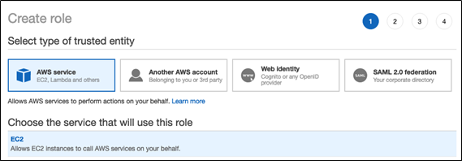
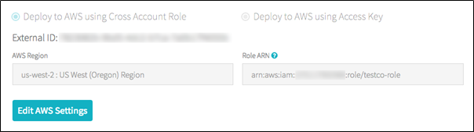
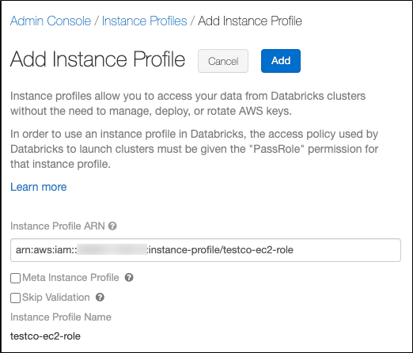
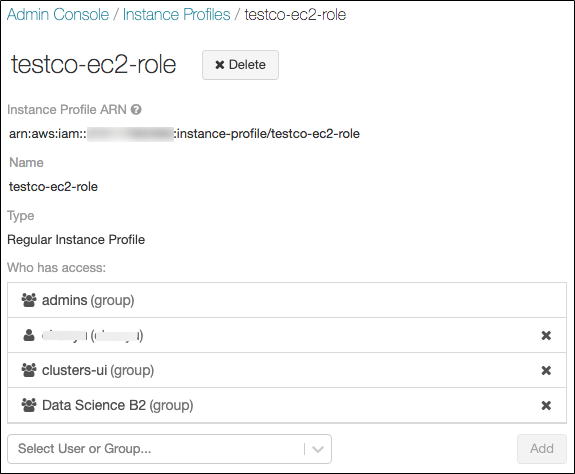
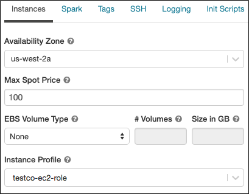
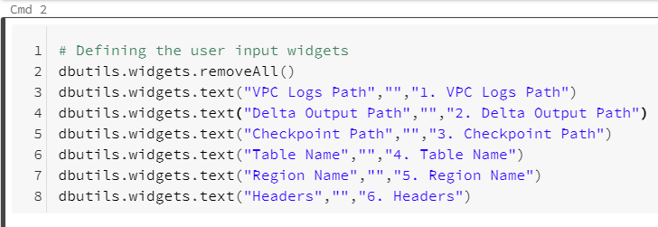
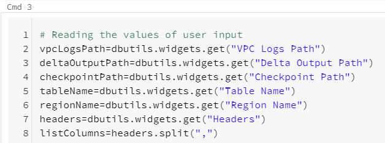
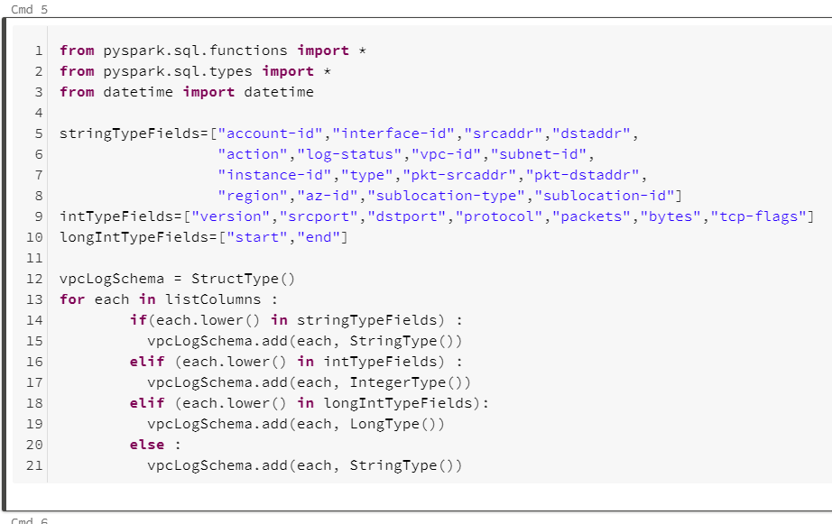
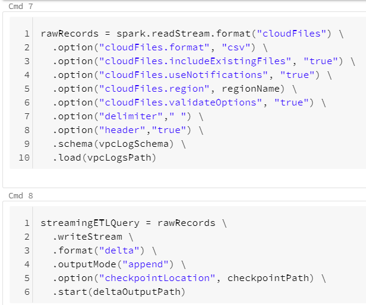
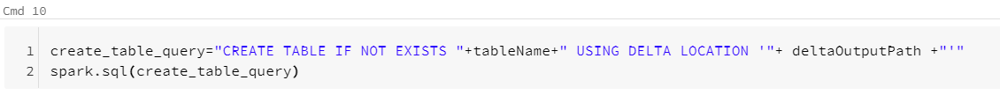

# Ingesting AWS VPC Logs Into Databricks

**User Guide 1.0.0**

Note:

This document is produced by Databricks as a reference. Databricks makes no warranties or guarantees. Information contained within may not be the most up-to-date available. Information in this document is subject to change without notice. Databricks shall not be liable for any damages resulting from technical errors or omissions that may be present in this document, or from use of this document.

Databricks and the Databricks logo are trademarks or service marks of Databricks, Inc. in the US and other countries. Microsoft Azure and Azure are trademarks of Microsoft Inc. Azure Databricks is a product provided by Microsoft, please see their website for additional information. All other trademarks within this document are property of their respective companies. Copyright 2020 Databricks, Inc. For more information, visit [http://www.databricks.com](http://www.databricks.com/).

Technical documentation and support materials include details based on the full set of capabilities and features of a specific release. Access to some functionality requires specific license types (tiers).

#
# Contents

- [Overview](#Overview)
- [VPC Flow Log To S3](#VPC%20Flow%20Log%20To%20S3)
    - [Creating a Flow Log that Publishes to Amazon S3](#Creating%20a%20Flow%20Log%20that%20Publishes%20to%20Amazon%20S3)
    - [Default Flow Log Record Format](#Default%20Flow%20Log%20Record%20Format)
    - [Example Log Record](#Example%20Log%20Record)
- [S3 To Databricks](#S3%20To%20Databricks)
    - [Requirements](#Requirements)
    - [Secure Access To S3 buckets Using Instance Profiles](#Secure%20Access%20To%20S3%20buckets%20Using%20Instance%20Profiles)
    - [Configuring AWS to allow use of "useNotifications=true" in Notebook](#Configuring%20AWS%20to%20allow%20use%20of%20"useNotifications=true"%20in%20Notebook)
    - [VPC Flow Logs Notebook](#VPC%20Flow%20Logs%20Notebook)
    - [Troubleshooting](#Troubleshooting)
- [Known Issues/Limitations](#Known%20Issues/Limitations)
- [References](#References)

# Overview

This document provides information on how to get your AWS VPC logs into the Databricks Delta table using Databricks Auto Loader.

# VPC Flow Log To S3

Flow logs collect flow log records, consolidate them into log files, and then publish the log files to the Amazon S3 bucket at 5-minute intervals. Each log file contains flow log records for the IP traffic recorded in the previous five minutes.

The maximum file size for a log file is 75 MB. If the log file reaches the file size limit within the 5-minute period, the flow log stops adding flow log records to it. Then it publishes the flow log to the Amazon S3 bucket and creates a new log file. Log files are saved to the specified Amazon S3 bucket using a folder structure that is determined by the flow log's ID, Region, and the date on which they are created. The bucket folder structure uses the following format:

`bucket_ARN/optional_folder/AWSLogs/aws_account_id/vpcflowlogs/region/year/month/day/log_file_name.log.gz`

Similarly, the log file's filename is determined by the flow log's ID, Region, and the date and time that it was created by the flow logs service. File names use the following format:

`aws_account_id_vpcflowlogs_region_flow_log_id_timestamp_hash.log.gz`

## Creating a Flow Log that Publishes to Amazon S3

After you have created and configured your Amazon S3 bucket, you can create flow logs for your VPCs, subnets, or network interfaces.

To create a flow log for a VPC or a subnet using the console:

1. Open the Amazon VPC console at [https://console.aws.amazon.com/vpc/](https://console.aws.amazon.com/vpc/).
2. In the navigation pane, choose Your VPCs or Subnets.
3. Select one or more VPCs or subnets, then choose Actions and then Create flow log.
4. For Filter, specify the type of IP traffic data to log. Choose All to log accepted and rejected traffic, Rejected to record only rejected traffic, or Accepted to record only accepted traffic.
5. For Maximum aggregation interval, choose the maximum period of time during which a flow is captured and aggregated into one flow log record.
6. For Destination, choose Send to an Amazon S3 bucket.
7. For S3 bucket ARN, specify the Amazon Resource Name (ARN) of an existing Amazon S3 bucket. You can include a subfolder in the bucket ARN. The bucket cannot use AWSLogs as a subfolder name, as this is a reserved term.
    For example, to specify a subfolder named my-logs in a bucket named `my-bucket`, use the following ARN:

    `arn:aws:s3:::my-bucket/my-logs/`

8. For Format, choose AWS default format in the flow log record.
9. (Optional) Choose Add Tag to apply tags to the flow log.
10. Choose Create.

## Default Flow Log Record Format

```
version, accountid, interfaceid, srcaddr, dstaddr, srcport, dstport, protocol, packets, bytes, start, end, action, logstatus
```

Example Log Record:

```
2 520045580702 eni-0a1fb279bf0b863bc 209.220.231.25 10.36.29.39 50002 20485 6 3 120 1606460541 1606460839 REJECT OK
```

# S3 To Databricks

To ingest data from AWS S3 bucket to Databricks, Databricks Auto Loader is being used in the Notebook. Auto Loader incrementally and efficiently processes new data files as they arrive in S3 bucket. It provides a Structured Streaming source called cloudFiles. Given an input directory path on the cloud file storage, the cloudFiles source automatically processes new files as they arrive, with the option of also processing existing files in that directory.

## Requirements

1. Databricks Runtime 7.3 or above
2. AWS administrator access to IAM roles and policies in the AWS account of the Databricks deployment and the AWS account of the S3 bucket.
3. The target S3 bucket must belong to the same AWS account as the Databricks deployment.

For proper functioning of the notebook to get data from S3 buckets to Databricks, we need to provide secure access to the S3 buckets using Instance profiles and configure AWS to allow use of `useNotifications=true` in Notebook. Follow the steps below to provide the required access to the notebook.

## Secure Access To S3 buckets Using Instance Profiles

An **IAM role** is an IAM identity with permission policies that determine what the identity can and cannot do in AWS. However, instead of being uniquely associated with one person, a role is intended to be assumable by anyone who needs it.

An **instance profile** is a container for an IAM role that you can use to pass the role information to an EC2 instance when the instance starts.

Secure access using **IAM roles and instance profiles are required** when you want to give access to use AWS resources but don't want to embed AWS keys within the app (where they can be difficult to rotate and where users can potentially extract them).

To access AWS resources securely, you can launch Databricks clusters with instance profiles that allow you to access your data from Databricks clusters without having to embed your AWS keys in notebooks.

Follow the below steps to securely access S3 bucket using instance profiles:

1. Create an instance profile to access S3 bucket
    - In the AWS console, go to the ***IAM service.***
    - Click the ***Roles*** tab in the sidebar.
    - Click ***Create role***.
        - Under ***Select type of trusted entity***, select ***AWS service.***
        - Under ***Choose the service that will use this role***, select ***EC2***.
            
            
        - Click ***Next: Permissions, Next: Tags***, and ***Next: Review.***
        - In the **Role name** field, type a role name.
        - Click ***Create role***. The list of roles displays.
    - In the role list, click the role.
    - Add an inline policy to the role. This policy grants access to the S3 bucket.
        - In the Permissions tab, click ***Add Inline policy***.
        - Click the ***JSON*** tab.
        - Copy this policy and set _\<s3-bucket-name\>_ to the name of your bucket.
            ```json
            {
            "Version": "2012-10-17",
            "Statement": [
                {
                "Effect": "Allow",
                "Action": [
                    "s3:ListBucket"
                ],
                "Resource": [
                    "arn:aws:s3:::<s3-bucket-name>"
                ]
                },
                {
                "Effect": "Allow",
                "Action": [
                    "s3:PutObject",
                    "s3:GetObject",
                    "s3:DeleteObject",
                    "s3:PutObjectAcl"
                ],
                "Resource": [
                    "arn:aws:s3:::<s3-bucket-name>/*"
                ]
                }
            ]
            }
            ```
        - Click ***Review policy***.
        - In the ***Name*** field, type a policy name.
        - Click ***Create policy***.
    - From the role summary displayed, copy the ***Instance Profile ARN***.
2. Create a bucket policy for the target S3 bucket that grants the required permissions to the target bucket.
    - In the AWS console, go to the **S3 service.**
    - From the list select your target S3 bucket.
    - In the **permissions tab** go to **Bucket Policy**.
    - Modify the policy to ensure that the S3 bucket has all the required permissions. In the bucket policy, append the policy given below in case the existing policy has some pre-existing other important settings, else replace it with the policy given below. Replace _\<aws-account-id-databricks\>_ with the AWS account ID where the Databricks environment is deployed, _\<iam-role-for-s3-access\>_ with the role you created in the very first step, and _\<s3-bucket-name\>_ with the bucket name.
        ```json
        {
        "Version": "2012-10-17",
        "Statement": [
            {
            "Sid": "Example permissions",
            "Effect": "Allow",
            "Principal": {
                "AWS": "arn:aws:iam::<aws-account-id-databricks>:role/<iam-role-for-s3-access>"
            },
            "Action": [
                "s3:GetBucketLocation",
                "s3:ListBucket"
            ],
            "Resource": "arn:aws:s3:::<s3-bucket-name>"
            },
            {
            "Effect": "Allow",
            "Principal": {
                "AWS": "arn:aws:iam::<aws-account-id-databricks>:role/<iam-role-for-s3-access>"
            },
            "Action": [
                "s3:PutObject",
                "s3:GetObject",
                "s3:DeleteObject",
                "s3:PutObjectAcl"
            ],
            "Resource": "arn:aws:s3:::<s3-bucket-name>/*"
            }
        ]
        }
        ```
    - Click ***Save***.
3. Get the IAM role used to create the Databricks deployment
    
    This is the IAM role you used when [setting up the Databricks account](https://docs.databricks.com/administration-guide/account-settings/aws-accounts.html).

    - In the Databricks instance, log in to the [Account Console](https://docs.databricks.com/administration-guide/account-settings/account-console.html) as the account owner (Click the user profile icon at the top right and select Manage Account.)
    - Click the ***AWS Account tab***.
    - Note the role name at the end of the Role ARN, for example here it's ***testco-role***.
    
        
4. Add the S3 IAM role to the EC2 policy
    - In the AWS console, go to the ***IAM*** service.
    - Click the ***Roles*** tab in the sidebar.
    - Click the role you noted in the above step.
    - On the Permissions tab, click the policy.
    - Click ***Edit Policy***.
    - Modify the policy to allow Databricks to pass the IAM role you created in Step 1 to the EC2 instances for the Spark clusters. Here is an example of what the new policy should look like. Replace _\<iam-role-for-s3-access\>_ with the role you created in the very first step.
        ```json
        {
        "Version": "2012-10-17",
        "Statement": [
            {
            "Sid": "Stmt1403287045000",
            "Effect": "Allow",
            "Action": [
                "ec2:AssociateDhcpOptions",
                "ec2:AssociateIamInstanceProfile",
                "ec2:AssociateRouteTable",
                "ec2:AttachInternetGateway",
                "ec2:AttachVolume",
                "ec2:AuthorizeSecurityGroupEgress",
                "ec2:AuthorizeSecurityGroupIngress",
                "ec2:CancelSpotInstanceRequests",
                "ec2:CreateDhcpOptions",
                "ec2:CreateInternetGateway",
                "ec2:CreateKeyPair",
                "ec2:CreatePlacementGroup",
                "ec2:CreateRoute",
                "ec2:CreateSecurityGroup",
                "ec2:CreateSubnet",
                "ec2:CreateTags",
                "ec2:CreateVolume",
                "ec2:CreateVpc",
                "ec2:CreateVpcPeeringConnection",
                "ec2:DeleteInternetGateway",
                "ec2:DeleteKeyPair",
                "ec2:DeletePlacementGroup",
                "ec2:DeleteRoute",
                "ec2:DeleteRouteTable",
                "ec2:DeleteSecurityGroup",
                "ec2:DeleteSubnet",
                "ec2:DeleteTags",
                "ec2:DeleteVolume",
                "ec2:DeleteVpc",
                "ec2:DescribeAvailabilityZones",
                "ec2:DescribeIamInstanceProfileAssociations",
                "ec2:DescribeInstanceStatus",
                "ec2:DescribeInstances",
                "ec2:DescribePlacementGroups",
                "ec2:DescribePrefixLists",
                "ec2:DescribeReservedInstancesOfferings",
                "ec2:DescribeRouteTables",
                "ec2:DescribeSecurityGroups",
                "ec2:DescribeSpotInstanceRequests",
                "ec2:DescribeSpotPriceHistory",
                "ec2:DescribeSubnets",
                "ec2:DescribeVolumes",
                "ec2:DescribeVpcs",
                "ec2:DetachInternetGateway",
                "ec2:DisassociateIamInstanceProfile",
                "ec2:ModifyVpcAttribute",
                "ec2:ReplaceIamInstanceProfileAssociation",
                "ec2:RequestSpotInstances",
                "ec2:RevokeSecurityGroupEgress",
                "ec2:RevokeSecurityGroupIngress",
                "ec2:RunInstances",
                "ec2:TerminateInstances"
            ],
            "Resource": [
                "*"
            ]
            },
            {
            "Effect": "Allow",
            "Action": "iam:PassRole",
            "Resource": "arn:aws:iam::<aws-account-id-databricks>:role/<iam-role-for-s3-access>"
            },
            {
            "Effect": "Allow",
            "Action": [
                "iam:CreateServiceLinkedRole",
                "iam:PutRolePolicy"
            ],
            "Resource": "arn:aws:iam::*:role/aws-service-role/spot.amazonaws.com/AWSServiceRoleForEC2Spot",
            "Condition": {
                "StringLike": {
                "iam:AWSServiceName": "spot.amazonaws.com"
                }
            }
            }
        ]
        }
        ```
    - Click ***Review policy***.
    - Click ***Save changes***.
5. Add the instance profile to Databricks
    - In the Databricks instance, Go to the[Admin Console](https://docs.databricks.com/administration-guide/admin-console.html). ( go to the top right of the workspace UI, click the user account icon, and select Admin Console)
    - Click the **Instance Profiles tab**.
    - Click the **Add Instance Profile** button. A dialog displays.
    - Paste in the instance profile ARN from step 1.
        
        

        You select the Meta Instance Profile property only when you are setting up [IAM credential passthrough](https://docs.databricks.com/security/credential-passthrough/iam-passthrough.html) (here we are not using it so do not select this checkbox)
 
        Databricks validates that the instance profile ARN is both syntactically and semantically correct. To validate semantic correctness, Databricks does a dry run by launching a cluster with this instance profile. Any failure in this dry run produces a validation error in the UI. Validation of the instance profile can fail if the instance profile contains the tag-enforcement policy, preventing you from adding a legitimate instance profile. If the validation fails and you still want to add the instance profile, select the Skip Validation checkbox.

    - Click Add.
    - Optionally specify the users who can launch clusters with the instance profile.
        
        

6. Launch a cluster with the instance profile
    - In the Databricks instance, select ***cluster*** from the side view.
    - Select or create a cluster.
    - Open the ***Advanced Options*** section.
    - On the ***Instances*** tab, select the instance profile from the Instance Profile drop-down list. This drop-down includes all of the instance profiles that are available for the cluster.

        
    - Once the cluster has started, Verify that you can access the S3 bucket, using the **`dbutils.fs.ls("s3a://<s3-bucket-name>/")`** command. If the command runs successfully, it will list the files and directories within the bucket and confirm secure connection to S3 bucket has been made.
    - Ensure that there aren't any errors while executing the above command.

:warning: Once a cluster launches with an instance profile, anyone who has attach permission to the cluster can access the underlying resources controlled by this role. To limit unwanted access, you can use cluster ACLs to restrict the attach permissions.

## Configuring AWS to allow use of "useNotifications=true" in Notebook

The "File Notification" mode is used in the notebook. The "File Notification" mode uses AWS SNS and SQS services that subscribe to file events from the input directory. Auto Loader automatically sets up the AWS SNS and SQS services. File notification mode is more performant and scalable for large input directories. To use this mode, you must configure permissions for the AWS SNS and SQS services and specify .option("cloudFiles.useNotifications","true"). To use file notification mode, attach the following JSON policy document to your [IAM user or role](https://docs.databricks.com/administration-guide/cloud-configurations/aws/instance-profiles.html). If you are unable to set up the permissions specified in the JSON policy document, you can optionally ask an administrator to perform the setup for you.
Follow the below steps to use this mode:
- In the AWS console, go to the ***IAM service***. Click the ***Roles tab*** in the sidebar.
- Select your IAM role from the list
- Attach the following JSON policy document to the selected role.
    ```json
    {
        "Version": "2012-10-17",
        "Statement": [
            {
                "Sid": "VisualEditor0",
                "Effect": "Allow",
                "Action": [
                    "s3:GetBucketNotification",
                    "s3:PutBucketNotification",
                    "sns:ListSubscriptionsByTopic",
                    "sns:GetTopicAttributes",
                    "sns:SetTopicAttributes",
                    "sns:CreateTopic",
                    "sns:TagResource",
                    "sns:Publish",
                    "sns:Subscribe",
                    "sqs:CreateQueue",
                    "sqs:DeleteMessage",
                    "sqs:DeleteMessageBatch",
                    "sqs:ReceiveMessage",
                    "sqs:SendMessage",
                    "sqs:GetQueueUrl",
                    "sqs:GetQueueAttributes",
                    "sqs:SetQueueAttributes",
                    "sqs:TagQueue",
                    "sqs:ChangeMessageVisibility",
                    "sqs:ChangeMessageVisibilityBatch"
                ],
                "Resource": [
                    "arn:aws:s3:::<bucket-name>",
                    "arn:aws:sqs:<region>:<account-number>:databricks-auto-ingest-*",
                    "arn:aws:sns:<region>:<account-number>:databricks-auto-ingest-*"
                ]
            },
            {
                "Sid": "VisualEditor1",
                "Effect": "Allow",
                "Action": [
                    "sqs:ListQueues",
                    "sns:ListTopics",
                    "sqs:ListQueueTags"
                ],
                "Resource": "*"
            },
            {
                "Sid": "VisualEditor2",
                "Effect": "Allow",
                "Action": [
                    "sns:DeleteTopic",
                    "sqs:DeleteQueue"
                ],
                "Resource": [
                    "arn:aws:sqs:<region>:<account-number>:databricks-auto-ingest-*",
                    "arn:aws:sns:<region>:<account-number>:databricks-auto-ingest-*"
                ]
            },
            {
                "Sid": "VisualEditor3",
                "Effect": "Allow",
                "Action": "sns:Unsubscribe",
                "Resource": "*"
            }
        ]
    }

    ```

**Note:** "Action": "sns:Unsubscribe" for "Resource": "\*" added at last to the above permissions JSON is slightly different from the documentation provided [here](https://docs.databricks.com/spark/latest/structured-streaming/auto-loader.html#permissions). This was modified for resolving the following error displayed when the policy as per documentation was added.


## VPC Flow Logs Notebook

The notebook is used to create a table from VPC Flow Logs ingested in an S3 bucket. The user parameters and important commands of the notebook are explained below:

### User Parameters**

:warning: All Input parameters are mandatory!

The **VPC Logs Path**, **Region Name** and **Headers** can be obtained from AWS account admin.

- **VPC Logs Path:** The folder in the S3 bucket from which to collect data. It should be of the form `s3://<bucket-name>/AWSLogs/<aws-account-id>/vpcflowlogs/<bucket-region>/*`. Specify the specific account id and bucket region in case there are multiple such directories in the bucket or you may use `*` in place for selecting all.
    
    Example: `s3://mybucket/AWSLogs/1234567890/vpcflowlogs/us-east-1/*`

- **Delta Output Path:** The DBFS or S3 path where the parsed data files should be stored. Ensure that this path is either empty(contains no data files) or is not a pre-existing path or does not contain any data that does not follow VPC Logs schema (schema as specified in cmd 5 in notebooks).

    Example: `/VpcLogData/`

- **Checkpoint Path:** The path for checkpoint files. The checkpoint files store information regarding the last processed record written to the table. Ensure that only one VPC Logs Path is associated with a given checkpoint Path, that is, the same checkpoint Path should not be used for any other VPC Logs Path.
    
    Example: `/VpcLogData.checkpoint`

- **Table Name:** The table name to create. A table name can contain only lowercase alphanumeric characters and underscores and must start with a lowercase letter or underscore. Ensure a table with provided name does not pre-exist, else it will not be created.

- **Region Name:** The region name in which S3 bucket and the AWS SNS and SQS services are created.

    Example: `us-east-1`

- **Headers:** Comma separated list of headers for the VPC logs in the order as they are written to S3 bucket.

    Example: version,account-id,interface-id,srcaddr,dstaddr,srcport,dstport,protocol,packets,bytes,start,end,action,logstatus

### Important Commands

- Cmd2 declares the user parameters.
    
    

- Cmd 3 reads the user parameter values.
    
    

- Cmd 5defines the scheme for the data to be read.

    

- Cmd 7 creates a read stream and defines the schema for the read stream. Cmd 8 parses and writes the parsed data to delta files.

    

- Cmd11 creates a table based on the parsed data.

    
 
To run the notebook, **attach it to a cluster**, fill in all the required parameters and select the **Run All** option. In case of any error, the error is displayed at the bottom of the notebook cells where it occurred.

## Troubleshooting

**Issue: cmd 11** in both notebooks throws "**AnalysisException**: You are trying to create an external table default.\<table\> from \<Delta Output Path\> using Databricks Delta, but the schema is not specified when the input path is empty". After a few seconds, the write stream command in cmd 8 will also stop with a "stream stopped" message. This issue occurs when the write stream command in cmd 8 has not written output to \<Delta Output Path\> and not completed initialization (indicated by "stream initializing" message displayed)

**Solution:** In case of above issue run the cmd 8 cell individually using the **Run \> Run cell** option on the top right corner of the cell. Once the stream initialization is completed, and some output is written to the \<Delta Output Path\>, run the command in cmd 11 cell individually using the **Run \> Run cell** option on the top right corner of the cell.

# Known Issues/Limitations

- We can have multiple flow logs ingesting into the same S3 bucket location. In this case, if the data format of each flow log is different, it may cause issues in table population as the schema is static and would match with only one of the formats. This may lead to incorrect values in the table where the schema of the table doesn't match the format of the different logs.
 To ensure this doesn't happen, Ensure that the **format of all VPC flow logs dumped into the same S3 bucket is the same**.
- We can change the format of VPC flow logs data that is being dumped in S3 bucket. In this case, the schema will change and the table will be populated according to the new schema. The pre-existing old data populated according to the old schema will now be re-interpreted with the new schema in the table and this may lead to incorrect values in the table. Hence whenever you change the format of VPC flow logs, dump these new logs in a new bucket and in the notebook, you will have to change the VPC Logs Path to a new S3 bucket path, Delta Output Path, Checkpoint Path and Table Name to new Values, the Header parameters according to the new VPC flow log format. This ensures that incorrect values are not present in the table.

# References

- AWS VPC Log Format: [https://docs.aws.amazon.com/vpc/latest/userguide/flow-logs.html#flow-logs-default](https://docs.aws.amazon.com/vpc/latest/userguide/flow-logs.html#flow-logs-default)
- Configuring AWS Account: [https://docs.databricks.com/administration-guide/cloud-configurations/aws/instance-profiles.html](https://docs.databricks.com/administration-guide/cloud-configurations/aws/instance-profiles.html)
- Setting Up Auto Loader: [https://docs.databricks.com/spark/latest/structured-streaming/auto-loader.html](https://docs.databricks.com/spark/latest/structured-streaming/auto-loader.html)
