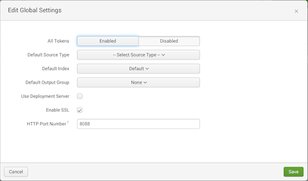

# Push Data to Splunk from Databricks

**User Guide 1.0.0**

Note:

This document is produced by Databricks as a reference. Databricks makes no warranties or guarantees. Information contained within may not be the most up-to-date available. Information in this document is subject to change without notice. Databricks shall not be liable for any damages resulting from technical errors or omissions that may be present in this document, or from use of this document.

Databricks and the Databricks logo are trademarks or service marks of Databricks, Inc. in the US and other countries. Microsoft Azure and Azure are trademarks of Microsoft Inc. Azure Databricks is a product provided by Microsoft, please see their website for additional information. All other trademarks within this document are property of their respective companies. Copyright 2020 Databricks, Inc. For more information, visit [http://www.databricks.com](http://www.databricks.com/).

Technical documentation and support materials include details based on the full set of capabilities and features of a specific release. Access to some functionality requires specific license types (tiers).

# Contents

- [Overview](#Overview)
- [Push Data To Splunk](#Push%20Data%20To%20Splunk)
    - [Configure HEC in Splunk Enterprise](#Configure%20HEC%20in%20Splunk%20Enterprise)
        - [Enable HEC](#Enable%20HEC)
        - [Create HEC token](#Create%20HEC%20token)
    - [Configure Sourcetype for the events](#Configure%20Sourcetype%20for%20the%20events)
        - [Steps to configure Sourcetype](#Steps%20to%20configure%20Sourcetype)
    - [Using Databricks secret scope to store the Splunk HEC token securely](#Using%20Databricks%20secret%20scope%20to%20store%20the%20Splunk%20HEC%20token%20securely)
    - [Notebook Parameters](#Notebook%20Parameters)
    - [Import Splunk Instance's Certificate in Databricks](#Import%20Splunk%20Instance's%20Certificate%20in%20Databricks)
- [Limitations](#Limitations)
- [References](#References)


# Overview

This document provides information on how to get your data from Databricks into Splunk using a Databricks notebook. The notebook is used to execute queries on a table in Databricks and push the result obtained to Splunk using Splunk HTTP Event Collector (HEC).

Splunk HEC lets you send data and application events to a Splunk deployment over the HTTP and Secure HTTP (HTTPS) protocols. HEC uses a token-based authentication model. You can generate a token and then configure a logging library or HTTP client with the token to send data to HEC in a specific format. This process eliminates the need for a Splunk forwarder when you send application events. After you enable HEC, as a developer, you can use HEC tokens in your app to send data to HEC. You do not need to include Splunk credentials in your app or supported files.

# Push Data To Splunk

**Follow the steps below to push data from Databricks table to Splunk.**

## Configure HEC in Splunk Enterprise 

Follow the below steps to configure HTTP Event Collector.

### Enable HEC

- Open Splunk UI.
- Click Settings > Data Inputs.
- Click HTTP Event Collector.
- Click Global Settings.  

 
- In the All Tokens toggle button, select Enabled.
- (Optional) Choose a Default Source Type for all HEC tokens. You can also type in the name of the source type in the text field above the drop-down before choosing the source type.
- (Optional) Choose a Default Index for all HEC tokens.
- (Optional) Choose a Default Output Group for all HEC tokens.
- (Optional) To use a deployment server to handle configurations for HEC tokens, click the Use Deployment Server check box.
- (Optional) To have HEC listen and communicate over HTTPS rather than HTTP, click the Enable SSL checkbox.
- (Optional) Enter a number in the HTTP Port Number field for HEC to listen on. Note: Confirm that no firewall blocks the port number that you specified in the HTTP Port Number field, either on the clients or the Splunk instance that hosts HEC.
- Click Save.

### Create HEC token

- Click Settings > Add Data.
- Click monitor.
- Click HTTP Event Collector.
- In the Name field, enter a name for the token.
- (Optional) In the Source name override field, enter a source name for events that this input generates.
- (Optional) In the Description field, enter a description for the input.
- (Optional) In the Output Group field, select an existing forwarder output group.
- (Optional) If you want to enable indexer acknowledgment for this token, click the Enable indexer acknowledgment checkbox.
- Click Next.
- (Optional) Confirm the source type and the index for HEC events.
- Click Review.
- Confirm that all settings for the endpoint are what you want.
- If all settings are what you want, click Submit. Otherwise, click < to make changes.
- Note the token value that Splunk Web displays for reference.

Reference: [https://docs.splunk.com/Documentation/Splunk/8.1.1/Data/UsetheHTTPEventCollector](https://docs.splunk.com/Documentation/Splunk/8.1.1/Data/UsetheHTTPEventCollector)

## Configure Sourcetype for the events

The sourcetype to be associated with the events pushed from this notebook should be configured to have the following properties specified. Note that a user is required to change the below configurations, based on the data that is being pushed to Splunk.

- `LINE_BREAKER = ([\r\n]+)`
- `SHOULD_LINEMERGE = false`
- `KV_MODE = json`

### Steps to configure Sourcetype

- In Splunk web UI go to settings > Data > Source types
- Select your sourcetype to edit or Click New Sourcetype in the top right-hand corner to create a new sourcetype. In case of a new sourcetype, provide a name for the sourcetype and select the destination app same as the App context specified while configuring the Splunk HEC Token that you will be using, in the dialog box that opens.
- In the Event Breaks section select Every Line
- In the Advanced section click New setting and add `KV_MODE = JSON` as follows.  
  

**Note**: In case you are editing an existing sourcetype, make sure that the changes In the Event Breaks and Advanced section do not affect the events that are already associated with this sourcetype.

- Click Save.

If the user wants to change the default timestamp extraction from these events, the user can follow the steps specified here [Configure timestamp recognition](https://docs.splunk.com/Documentation/Splunk/latest/Data/Configuretimestamprecognition)

## Using Databricks secret scope to store the Splunk HEC token securely

In the notebook to push data to Splunk, the Splunk HEC token value needs to be specified. Since the HEC token value is sensitive information, the user can configure Databricks secrets to store the token value securely. This enables the user to store the token value securely and not expose it in the notebook in plain text form.

To securely store the Splunk HEC Token value, follow the following steps:

1. Install Databricks CLI and setup authentication using the below commands

    **Install:** `pip install databricks-cli`

    **Set-up:** `databricks configure --token`

    Running the setup command opens an interactive CLI. Specify the Databricks host address and the token value prompted and Enter. The token here refers to a personal access token created in Databricks. Follow the steps [here](https://docs.databricks.com/dev-tools/api/latest/authentication.html) to configure the token.

    Refer [https://docs.databricks.com/dev-tools/cli/index.html#set-up-the-cli](https://docs.databricks.com/dev-tools/cli/index.html#set-up-the-cli)  for more details regarding Databricks CLI.

2. Create a Databricks backed Secret scope using following commands:

    `databricks secrets create-scope --scope <scope-name>`

    **Or**

    `databricks secrets create-scope --scope <scope-name> --initial-manage-principal users`

    Refer for details: [https://docs.databricks.com/security/secrets/secret-scopes.html#create-a-databricks-backed-secret-scope](https://docs.databricks.com/security/secrets/secret-scopes.html#create-a-databricks-backed-secret-scope)

3. Create a key and store the secret using following command:

    `databricks secrets put --scope <scope-name> --key <key-name>`

    The command opens an editor. Enter or paste the Splunk HEC token here and save it.

    Refer [https://docs.databricks.com/security/secrets/secrets.html#create-a-secret](https://docs.databricks.com/security/secrets/secrets.html#create-a-secret) for more details regarding databricks scope creation.

## Notebook Parameters

The notebook push_to_splunk is used to execute queries on a table in Databricks and push the result obtained to Splunk.

The notebook contains the following parameters ( **\*** denotes mandatory field).

- **Protocol** **\***: The protocol on which Splunk HTTP Event Collector(HEC) runs. Splunk HEC runs on `https` if Enable SSL checkbox is selected while configuring Splunk HEC Token in Splunk, else it runs on `http` protocol. If you do not have access to the Splunk HEC Configuration page, you can ask your Splunk Admin if the `Enable SSL checkbox` is selected or not.
- **Verify Certificate** **\***: Specify if SSL server certificate verification is required for communication with Splunk. If Splunk HEC runs on http, SSL certificate verification doesn't work. If you set Verify Certificate as True, you may have to import a custom certificate from the Splunk server into Databricks. For this refer section: [Import Splunk Instance's Certificate in Databricks](#Import%20Splunk%20Instance's%20Certificate%20in%20Databricks). You can get the custom certificate from Splunk Admin.
- **Splunk Ip/Hostname** **\***: The Splunk IP/Hostname to push data to.
- **Splunk HEC Port** **\***: The Splunk HEC port. Default Splunk HEC Port is `8088`. You can get this value from Splunk Admin or Splunk HEC Configuration page.
- **Databricks Secret Scope** ***(Either Databricks Secret Scope and Secret Key or Splunk HEC Token are Mandatory Fields)***: The Databricks Secret Scope created using Databricks CLI to store the Secret Key containing the Splunk HEC Token value following step 2 here: [Databricks secret scope](#Using%20Databricks%20secret%20scope%20to%20store%20the%20Splunk%20HEC%20token%20securely)
- **Secret Key** ***(Either Databricks Secret Scope and Secret Key or Splunk HEC Token are Mandatory Fields)***: The secret key associated with specified Databricks Secret Scope which securely stores the Splunk HEC Token value following step 3 here: [Databricks secret scope](#Using%20Databricks%20secret%20scope%20to%20store%20the%20Splunk%20HEC%20token%20securely)
- **Splunk HEC Token** ***(Either Databricks Secret Scope and Secret Key or Splunk HEC Token are Mandatory Fields)***: The Splunk HEC token value configured in Splunk. It is used when the Databricks Secret Scope and Secret Key are not specified. You can get the value from Splunk Admin or configure as follows: [Configuring Splunk HEC](#Configure%20HEC%20in%20Splunk%20Enterprise)
- **Index (Optional)**: The Splunk index to push data into. Ensure that the Splunk index specified here is one of the allowed indexes associated with the Splunk HEC Token you are using here. You can get the list of such indexes from the Splunk HEC token Configuration page or from your Splunk Admin.
- **Source (Optional)**: It indicates the source of an event (in Splunk), that is, where the event originated.
- **Sourcetype (Optional)**: The sourcetype for an event is used to specify the data structure of an event. Ensure that this sourcetype is configured on the Splunk side to parse the events properly. If you do not specify the sourcetype here, ensure that the default sourcetype associated with the Splunk HEC Token being used here is also configured on the Splunk side for proper parsing of events. If you cannot make this configuration, ask your Splunk Admin to make the configuration for the sourcetype. Refer section: [Configure sourcetypes for events](#Configure%20Sourcetype%20for%20the%20events)
- **Host (Optional)**: The hostname or IP address of the network device that generated an event.
- **Database** ***(Either Database and Table Name or Advanced Query are Mandatory Fields.)***: The Databricks Database whose table needs to be used.
- **Table Name** ***(Either Database and Table Name or Advanced Query are Mandatory Fields.)***: Table from which the data to be pushed is obtained. The data is obtained by the query: `select * from <database>.<table>`. If you want a different form of query, use the **Advanced query** parameter.
- **Filter (Optional)**: Any filter or queries to run on top of the table specified.
- **Advanced Query** ***(Either Database and Table Name or Advanced Query are Mandatory Fields.)***: Complete query whose results you want to push to Splunk. If Advanced Query, Database, Table and Filter all are specified, the Advanced Query takes precedence and the other 3 parameters are ignored. The events to be pushed to Splunk are obtained from the Advanced Query in that case. However, if the Advanced query parameter is empty, the rows from the specified table based on the specified Filter are pushed to Splunk.

To run the notebook, **attach it to a cluster**, fill in all the required parameters and select the **Run All** option. In case of any error, the error is displayed at the bottom of the notebook cells where it occurred.

## Import Splunk Instance's Certificate in Databricks

This step is needed only if your Splunk instance has been configured to use a certificate and that certificate is not trusted by your browser/system. Follow the below steps to import the certificate.

- Create an init script that adds the entire CA chain and sets the `REQUESTS_CA_BUNDLE` property as follows in Databricks. In this example, PEM format CA certificates are added to the file `myca.crt` which is located at `/usr/local/share/ca-certificates/`.
    `<YOUR CERTIFICATE CONTENT>` can be obtained from Splunk Admin.   
    The `myca.crt` and `myca.pem` file names used here are just examples. Please use filenames that don't exist already in the locations as it may cause issues.


    ```
    #!/bin/bash

    cat << 'EOF' > /usr/local/share/ca-certificates/myca.crt
    -----BEGIN CERTIFICATE-----
    <YOUR CERTIFICATE CONTENT>
    -----END CERTIFICATE-----
    EOF

    update-ca-certificates

    PEM_FILE="/etc/ssl/certs/myca.pem"
    PASSWORD="<password>"
    KEYSTORE="/usr/lib/jvm/java-8-openjdk-amd64/jre/lib/security/cacerts"

    CERTS=$(grep 'END CERTIFICATE' $PEM_FILE| wc -l)

    # To process multiple certs with keytool, you need to extract
    # each one from the PEM file and import it into the Java KeyStore.

    for N in $(seq 0 $(($CERTS - 1))); do
    ALIAS="$(basename $PEM_FILE)-$N"
    echo "Adding to keystore with alias:$ALIAS"
    cat $PEM_FILE |
        awk "n==$N { print }; /END CERTIFICATE/ { n++ }" |
        keytool -noprompt -import -trustcacerts             -alias $ALIAS -keystore $KEYSTORE -storepass $PASSWORD
    done

    echo "export REQUESTS_CA_BUNDLE=/etc/ssl/certs/ca-certificates.crt" >> /databricks/spark/conf/spark-env.sh
    ```


- Attach the init script to the cluster as a [cluster-scoped init script](https://docs.databricks.com/clusters/init-scripts.html#cluster-scoped-init-scripts).
- Restart the cluster.

Refer [Importing custom certificates to Databricks](https://kb.databricks.com/python/import-custom-ca-cert.html) for more details on importing custom certificates in databricks.

**Now you can use this cluster to run the notebook when you want to use SSL server certificate verification for communication with Splunk.**

# Limitations

- This notebook doesn't provide a way of maintaining a checkpoint since it depends on the data that the user is collecting. Hence, this may cause data duplication in Splunk. If the intention is to run this notebook periodically we highly recommend implementing the checkpointing mechanism to avoid indexing the same data again in Splunk.

# References

- Self-signed certificates Splunk: [https://docs.splunk.com/Documentation/Splunk/8.1.1/Security/Howtoself-signcertificates](https://docs.splunk.com/Documentation/Splunk/8.1.1/Security/Howtoself-signcertificates)
[https://docs.splunk.com/Documentation/Splunk/8.1.1/Security/HowtoprepareyoursignedcertificatesforSplunk](https://docs.splunk.com/Documentation/Splunk/8.1.1/Security/HowtoprepareyoursignedcertificatesforSplunk)
- Splunk HEC: [https://docs.splunk.com/Documentation/Splunk/8.1.0/Data/UsetheHTTPEventCollector](https://docs.splunk.com/Documentation/Splunk/8.1.0/Data/UsetheHTTPEventCollector)
- Importing Splunk custom certificates to Databricks: [https://kb.databricks.com/python/import-custom-ca-cert.html](https://kb.databricks.com/python/import-custom-ca-cert.html)
- Databricks CLI setup: [https://docs.databricks.com/dev-tools/cli/index.html#](https://docs.databricks.com/dev-tools/cli/index.html#)
- Databricks Secret scope: [https://docs.databricks.com/security/secrets/secret-scopes.html](https://docs.databricks.com/security/secrets/secret-scopes.html)
[https://docs.databricks.com/security/secrets/secrets.html](https://docs.databricks.com/security/secrets/secrets.html)
