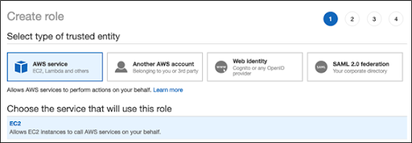
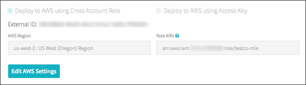
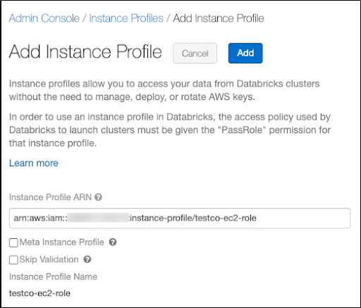
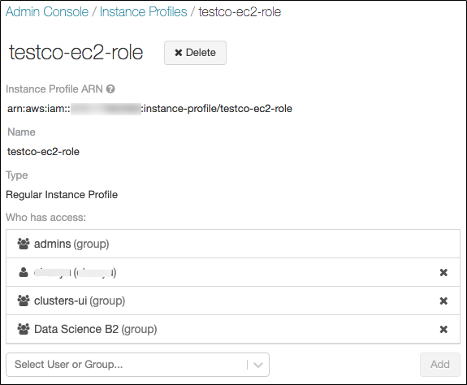
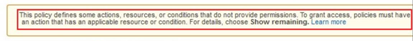
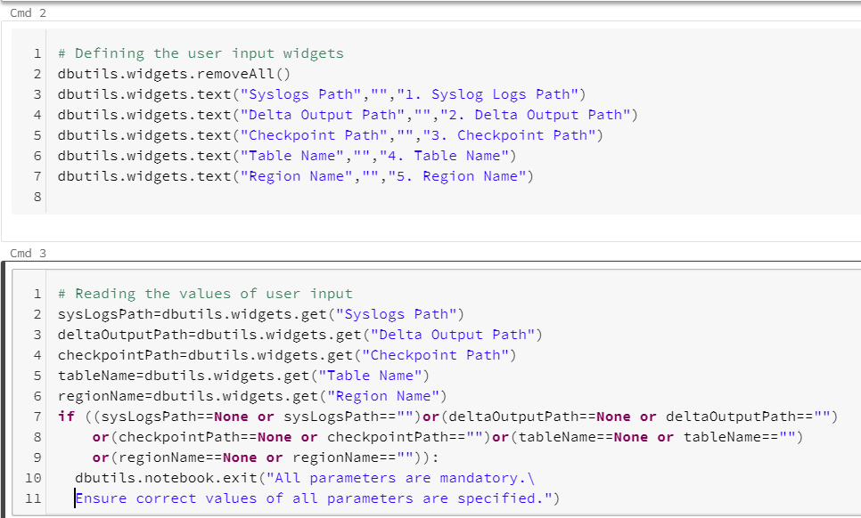
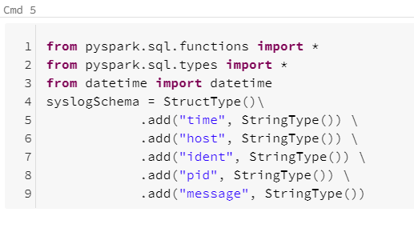
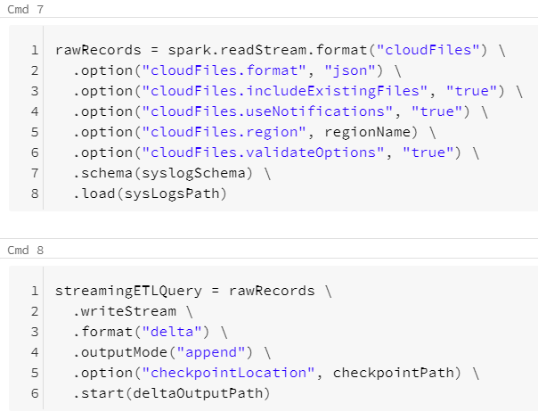
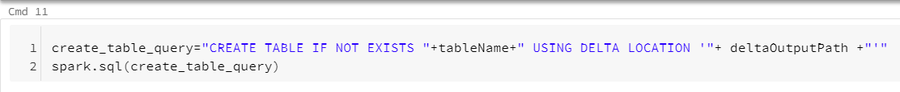

# Ingesting Syslogs Into Databricks

**User Guide 1.0.0**

Note:

This document is produced by Databricks as a reference. Databricks makes no warranties or guarantees. Information contained within may not be the most up-to-date available. Information in this document is subject to change without notice. Databricks shall not be liable for any damages resulting from technical errors or omissions that may be present in this document, or from use of this document.

Databricks and the Databricks logo are trademarks or service marks of Databricks, Inc. in the US and other countries. Microsoft Azure and Azure are trademarks of Microsoft Inc. Azure Databricks is a product provided by Microsoft, please see their website for additional information. All other trademarks within this document are property of their respective companies. Copyright 2020 Databricks, Inc. For more information, visit [http://www.databricks.com](http://www.databricks.com/).

Technical documentation and support materials include details based on the full set of capabilities and features of a specific release. Access to some functionality requires specific license types (tiers).

# Contents

- [Overview](#Overview)
- [Syslog To S3](#Syslog%20To%20S3)
    - [Installing and configuring Rsyslog](#Installing%20and%20configuring%20Rsyslog)
    - [Installing Fluentd](#Installing%20Fluentd)
    - [Configuring Fluentd to send logs to S3](#Configuring%20Fluentd%20to%20send%20logs%20to%20S3)
- [S3 To Databricks](#S3%20To%20Databricks)
    - [Requirements](#Requirements)
    - [Secure Access To S3 buckets Using Instance Profiles](#Secure%20Access%20To%20S3%20buckets%20Using%20Instance%20Profiles)
    - [Configuring AWS to allow use of "useNotifications=true" in Notebook](#Configuring%20AWS%20to%20allow%20use%20of%20"useNotifications=true"%20in%20Notebook)
    - [Syslogs Notebooks](#Syslogs%20Notebooks)
    - [Troubleshooting](#Troubleshooting)
- [References](#References)

# Overview

This document provides information on how to configure Rsyslog and Fluentd in your system to send the syslogs to a S3 bucket and get them into the Databricks Delta table using Databricks Autoloader.

# Syslog To S3

**Syslog** is a standard for [message logging](https://en.wikipedia.org/wiki/Log_file). It allows separation of the software that generates messages, the system that stores them, and the software that reports and analyzes them. It is used for system management and security auditing as well as general informational analysis, and debugging messages. A wide variety of devices, such as printers, routers, and message receivers across many platforms use the syslog standard. This permits the consolidation of logging data from different types of systems in a central repository.

**Rsyslog**(the **R**ocket-fast **sys**tem for **log** processing) is an open-source software utility used on UNIX and Unix-like computer systems for forwarding log messages in an IP network. It implements the basic Syslog protocol, extends it with content-based filtering, rich filtering capabilities, queued operations to handle offline outputs,support for different module outputs, flexible configuration options and adds features such as using TCP for transport.

**Fluentd** is an open-source data collector for a unified logging layer. Fluentd allows you to unify data collection and consumption for better use and understanding of data.

**Note**: By default, Rsyslog uses `RSYSLOG_TraditionalForwardFormat` to forward logs which is compatible with RFC 3164. Hence the notebook only supports this default format compatible with  RFC 3164 and no other format.

## Installing and configuring Rsyslog

**Follow these steps to install and configure Rsyslog:**

1. By default, the Rsyslog daemon is already installed and running in a CentOS 7 system. In order to check if Rsyslog service is present in the system, issue the below command. If the Rsyslog version number along with few other details is displayed, your system already has Rsyslog installed.
    ```sh
    sudo rsyslogd -v
    ```
2. If the Rsyslog package is not installed in your system, execute any of the below commands to install the service.
    ```sh
    sudo yum install rsyslog
    ```
    **or**
    ```sh
    sudo apt-get install rsyslog
    ```
    **or**
    ```sh
    sudo apk add rsyslog
    ```
    Ensure that the Rsyslog version is not very old version (preferably version 8 stable releases) as there may be some configurational changes in that case. In case the installation obtained is old, try installing latest stable version following steps mentioned here:[https://www.rsyslog.com/doc/v8-stable/installation/index.html](https://www.rsyslog.com/doc/v8-stable/installation/index.html)
3. In order to enforce the Rsyslog daemon installed in the system to act as a logging client and route all of the locally generated log messages to a local Fluentd server on the same machine, modify the Rsyslog configuration file as follows:
    1. Open the Rsyslog main configuration file at `/etc/rsyslog.conf`. Check if it has the rules section. If not, the `rsyslog.conf` file includes a reference to the `/etc/rsyslog.d/50-default.conf` file which defines the default logging rules. Open one of the two files which contains the logging rules for editing.
    2. At the end of the Rules section in the file add:
        ```
        *.* @(o)127.0.0.1:<port_to_send_logs_to>
        ```
        - `*.*` is used to select all logs.
        - `@` denotes UDP delivery.
        - `(o)` It selects octet-based framing, which provides compatibility to IETF’s syslog-transport-tls draft. `(o)` part is not strictly necessary.
        - The IP `127.0.0.1` denotes the localhost (as `fluentd` will be installed on same machine).
        - `<port_to_send_logs_to>` specifies the port to which logs are forwarded. Ensure that the port `<port_to_send_logs_to>` is available and not being used by another service on the system.
4. Finally, in order to apply the new configuration, the Rsyslog service needs to be restarted in order for the daemon to pick-up the changes, by running the below command:
    ```
    $ sudo systemctl restart rsyslog.service
    ```
5. If for some reasons Rsyslog daemon is not enabled during the boot time, issue the below command to enable the service system-wide:
    ```
    $ sudo systemctl enable rsyslog.service
    ```

## Installing Fluentd

Treasure Data, Inc. maintains stable packages for Fluentd and canonical plugins as Treasure Agent (the package is called td-agent). td-agent has versions v2, v3 and v4.
Refer: [Compatibility Matrix](https://docs.fluentd.org/quickstart/td-agent-v2-vs-v3-vs-v4) to check which td-agent is supported on which OS.

**Follow the below steps to install the td-agent rpm package on CentOs7, the stable Fluentd distribution package maintained by Treasure Data, Inc.**

1. Ensure the prerequisites here: [https://docs.fluentd.org/installation/before-install](https://docs.fluentd.org/installation/before-install) are present before installing.
2. Download and execute the install script with curl depending upon which td-agent version you want to install:
    ```
    # td-agent 4
    $ curl -L https://toolbelt.treasuredata.com/sh/install-redhat-td-agent4.sh | sh
    ```
    **or**
    ```
    # td-agent 3
    $ curl -L https://toolbelt.treasuredata.com/sh/install-redhat-td-agent3.sh | sh 
    ```

3. Executing this script will automatically install td-agent on your machine. This shell script registers a new rpm repository at `/etc/yum.repos.d/td.repo` and installs td-agent.
4. Use `/usr/lib/systemd/system/td-agent` script to start, stop, or restart the agent.
**Example**: `$sudo systemctl start td-agent.service`

**Note:**
- Refer [https://docs.fluentd.org/installation/install-by-rpm](https://docs.fluentd.org/installation/install-by-rpm) for more details on installing the td-agent rpm package.
- Refer: [https://docs.fluentd.org/installation](https://docs.fluentd.org/installation) for installation using different packages.

## Configuring Fluentd to send logs to S3

**Follow the below steps to configure fluentd to parse the Syslog and send to S3 buckets:**

1. Open the td-agent configuration file at `/etc/td-agent/td-agent.conf` for editing.
2. Add the following code to the end of the `/etc/td-agent/td-agent.conf` file to configure the source of Syslog.
    ```
    <source>
        @type syslog
        port <port_to_listen_on>
        bind 0.0.0.0
        tag <user_defined_tag>
        keep_time_key true
        <parse>
            message_format rfc3164
            time_format "%b %d %H:%M:%S"
            keep_time_key true
            with_priority true/false
        </parse>
    </source>
    ```
    - The `@type syslog` specifies the input is of type syslog which is one of the input plugins available in Fluentd.
    - The `<port_to_listen_on>` here is the same port that is configured in step 3.2 in Rsyslog configuration [here](#Installing%20and%20configuring%20Rsyslog). It is the port on which Fluentd will listen for Syslogs forwarded by Rsyslog.
    - The `bind 0.0.0.0` specifies the bind address to listen to which is by default 0.0.0.0 
    - The `<user_defined_tag>` is a user specified tag to identify this source uniquely.
    - The `message_format` in `<parse>` should be set to rfc3164 as the default Rsyslog Forwarding format is compatible with RFC 3164.
    - The `with_priority` in `<parse>` should be set to true if the Syslog messages being generated in your system contains the priority as the beginning field in the message. Else should be set to false.Default value is true.
    - The `time_format` in `<parse>` should be `"%b %d %H:%M:%S"`.

3. Now add the following configuration to configure it to send logs to S3 bucket:
    ```
    <match <user_defined_tag>.**>
        @type s3
        aws_key_id <aws_key_id >
        aws_sec_key <aws_sec_key>
        s3_bucket <bucket_name>
        s3_region us-east-1
        path <folder_path_within_bucket>
        <format>
            @type json
            keep_time_key true
        </format>
        <buffer>
            @type file
            path <path_to_local_buffer_file>
            timekey 60  # 1 min
            timekey_wait 10s
            chunk_limit_size 256m
        </buffer>
    </match>
    ```

    - The `<user_defined_tag>` is the one specified in the above step 2.
    - The `@type s3` specifies the output is to S3 which is one of the output plugins available in Fluentd.
    - The `<aws_key_id>` is the AWS account key id of account where you want to forward the Syslogs.
    - The `<aws_sec_key>` is the AWS secret key value for the account where you want to forward the Syslogs.
    - The `<bucket_name>` is the S3 bucket where you want to send the Syslogs to.
    - The `<folder_path_within_bucket>` is the path of the folder within the S3 bucket where the Syslogs will be logged. Ensure that this path does not contain any other data apart from Syslogs.
    - The `@type file` in `<buffer>` specifies the buffer to be a persistent buffer implementation that uses files to store buffer chunks on disk.
    - The `timekey` in `<buffer>` causes the output plugin to write events into chunks grouped by time key. You can change this value to a reasonable value according to the requirement.
    - The `timekey_wait` in `<buffer>` configures the flush delay for events. Default is 10 mins.
    - The `<path_to_local_buffer_file>` is the path to a local file that acts as a buffer. Buffers are used to store incoming streams temporally before transmitting to S3.

4. Finally, in order to apply the new configuration, the td-agent service needs to be restarted in order for the daemon to pick-up the changes, by running the below command:
    ```
    $ sudo systemctl restart td-agent.service
    ```
5. If for some reasons td-agent is not enabled during the boot time, issue the below command to enable the service system-wide:
    ```
    $ sudo systemctl enable td-agent.service.
    ```

#
# S3 To Databricks

To ingest data from AWS S3 bucket to Databricks, Databricks Auto Loader is being used in the Notebook. Auto Loader incrementally and efficiently processes new data files as they arrive in S3 bucket. It provides a Structured Streaming source called cloudFiles. Given an input directory path on the cloud file storage, the cloudFiles source automatically processes new files as they arrive, with the option of also processing existing files in that directory.

## Requirements

1. Databricks Runtime 7.3 or above
2. AWS administrator access to IAM roles and policies in the AWS account of the Databricks deployment and the AWS account of the S3 bucket.
3. The target S3 bucket must belong to the same AWS account as the Databricks deployment.

For proper functioning of the notebook to get data from S3 buckets to Databricks, we need to provide secure access to the S3 buckets using Instance profiles and configure AWS to allow use of "useNotifications=true" in Notebook. Follow the steps below to provide the required access to the notebook.

## Secure Access To S3 buckets Using Instance Profiles

An **IAM role** is an IAM identity with permission policies that determine what the identity can and cannot do in AWS. However, instead of being uniquely associated with one person, a role is intended to be assumable by anyone who needs it.

An **instance profile** is a container for an IAM role that you can use to pass the role information to an EC2 instance when the instance starts.

Secure access using **IAM roles and instance profiles are required** when you want to give access to use AWS resources but don't want to embed AWS keys within the app (where they can be difficult to rotate and where users can potentially extract them).

To access AWS resources securely, you can launch Databricks clusters with instance profiles that allow you to access your data from Databricks clusters without having to embed your AWS keys in notebooks.

**Follow the below steps to securely access S3 bucket using instance profiles:**

1. Create an instance profile to access S3 bucket
    - In the AWS console, go to the ***IAM service.***
    - Click the ***Roles*** tab in the sidebar.
    - Click ***Create role***.
        - Under ***Select type of trusted entity***, select ***AWS service.***
        - Under ***Choose the service that will use this role***, select ***EC2***.  
        
        - Click ***Next: Permissions***, ***Next: Tags*** and ***Next: Review.***
        - In the **Role name** field, type a role name.
        - Click ***Create role***. The list of roles displays.
    - In the role list, click the role.
    - Add an inline policy to the role. This policy grants access to the S3 bucket.
        - In the Permissions tab, click ***Add Inline policy***.
        - Click the ***JSON*** tab.
        - Copy this policy and set ***\<s3-bucket-name\>*** to the name of your bucket.

            ```json
            {
            "Version": "2012-10-17",
            "Statement": [
                {
                "Effect": "Allow",
                "Action": [
                    "s3:ListBucket"
                ],
                "Resource": [
                    "arn:aws:s3:::<s3-bucket-name>"
                ]
                },
                {
                "Effect": "Allow",
                "Action": [
                    "s3:PutObject",
                    "s3:GetObject",
                    "s3:DeleteObject",
                    "s3:PutObjectAcl"
                ],
                "Resource": [
                    "arn:aws:s3:::<s3-bucket-name>/*"
                ]
                }
            ]
            }

            ```

        - Click ***Review policy***.
        - In the ***Name*** field, type a policy name.
        - Click ***Create policy***.
    - From the role summary displayed, copy the ***Instance Profile ARN***.

2. Create a bucket policy for the target S3 bucket that grants the required permissions to the target bucket.
    - In the AWS console, go to the ***S3 service.***
    - From the list select your target S3 bucket.
    - In the ***permissions tab*** go to ***Bucket Policy***.
    - Modify the policy to ensure that the S3 bucket has all the required permissions. In the bucket policy, append the policy given below in case the existing policy has some pre-existing other important settings, else replace it with the policy given below. Replace ***\<aws-account-id-databricks\>*** with the AWS account ID where the Databricks environment is deployed,***\<iam-role-for-s3-access\>*** with the role you created in the very first step, and ***\<s3-bucket-name\>*** with the bucket name.
        ```json
        {
        "Version": "2012-10-17",
        "Statement": [
            {
            "Sid": "Example permissions",
            "Effect": "Allow",
            "Principal": {
                "AWS": "arn:aws:iam::<aws-account-id-databricks>:role/<iam-role-for-s3-access>"
            },
            "Action": [
                "s3:GetBucketLocation",
                "s3:ListBucket"
            ],
            "Resource": "arn:aws:s3:::<s3-bucket-name>"
            },
            {
            "Effect": "Allow",
            "Principal": {
                "AWS": "arn:aws:iam::<aws-account-id-databricks>:role/<iam-role-for-s3-access>"
            },
            "Action": [
                "s3:PutObject",
                "s3:GetObject",
                "s3:DeleteObject",
                "s3:PutObjectAcl"
            ],
            "Resource": "arn:aws:s3:::<s3-bucket-name>/*"
            }
        ]
        }
        ```

    - Click ***Save***.
    
3. Get the IAM role used to create the Databricks deployment.  
This is the IAM role you used when [setting up the Databricks account](https://docs.databricks.com/administration-guide/account-settings/aws-accounts.html).
    - In the Databricks instance, log in to the [Account Console](https://docs.databricks.com/administration-guide/account-settings/account-console.html) as the account owner (Click the user profile icon  at the top right and select Manage Account.)
    - Click the ***AWS Account tab***.
    - Note the role name at the end of the Role ARN, for example here it's ***testco-role***.  
    

4. Add the S3 IAM role to the EC2 policy
    - In the AWS console, go to the ***IAM*** service.
    - Click the ***Roles*** tab in the sidebar.
    - Click the role you noted in the above step.
    - On the Permissions tab, click the policy.
    - Click ***Edit Policy***.
    - Modify the policy to allow Databricks to pass the IAM role you created in Step 1 to the EC2 instances for the Spark clusters. Here is an example of what the new policy should look like. Replace ***\<iam-role-for-s3-access\>*** with the role you created in the very first step.
        ```json
        {
        "Version": "2012-10-17",
        "Statement": [
            {
            "Sid": "Stmt1403287045000",
            "Effect": "Allow",
            "Action": [
                "ec2:AssociateDhcpOptions",
                "ec2:AssociateIamInstanceProfile",
                "ec2:AssociateRouteTable",
                "ec2:AttachInternetGateway",
                "ec2:AttachVolume",
                "ec2:AuthorizeSecurityGroupEgress",
                "ec2:AuthorizeSecurityGroupIngress",
                "ec2:CancelSpotInstanceRequests",
                "ec2:CreateDhcpOptions",
                "ec2:CreateInternetGateway",
                "ec2:CreateKeyPair",
                "ec2:CreatePlacementGroup",
                "ec2:CreateRoute",
                "ec2:CreateSecurityGroup",
                "ec2:CreateSubnet",
                "ec2:CreateTags",
                "ec2:CreateVolume",
                "ec2:CreateVpc",
                "ec2:CreateVpcPeeringConnection",
                "ec2:DeleteInternetGateway",
                "ec2:DeleteKeyPair",
                "ec2:DeletePlacementGroup",
                "ec2:DeleteRoute",
                "ec2:DeleteRouteTable",
                "ec2:DeleteSecurityGroup",
                "ec2:DeleteSubnet",
                "ec2:DeleteTags",
                "ec2:DeleteVolume",
                "ec2:DeleteVpc",
                "ec2:DescribeAvailabilityZones",
                "ec2:DescribeIamInstanceProfileAssociations",
                "ec2:DescribeInstanceStatus",
                "ec2:DescribeInstances",
                "ec2:DescribePlacementGroups",
                "ec2:DescribePrefixLists",
                "ec2:DescribeReservedInstancesOfferings",
                "ec2:DescribeRouteTables",
                "ec2:DescribeSecurityGroups",
                "ec2:DescribeSpotInstanceRequests",
                "ec2:DescribeSpotPriceHistory",
                "ec2:DescribeSubnets",
                "ec2:DescribeVolumes",
                "ec2:DescribeVpcs",
                "ec2:DetachInternetGateway",
                "ec2:DisassociateIamInstanceProfile",
                "ec2:ModifyVpcAttribute",
                "ec2:ReplaceIamInstanceProfileAssociation",
                "ec2:RequestSpotInstances",
                "ec2:RevokeSecurityGroupEgress",
                "ec2:RevokeSecurityGroupIngress",
                "ec2:RunInstances",
                "ec2:TerminateInstances"
            ],
            "Resource": [
                "*"
            ]
            },
            {
            "Effect": "Allow",
            "Action": "iam:PassRole",
            "Resource": "arn:aws:iam::<aws-account-id-databricks>:role/<iam-role-for-s3-access>"
            },
            {
            "Effect": "Allow",
            "Action": [
                "iam:CreateServiceLinkedRole",
                "iam:PutRolePolicy"
            ],
            "Resource": "arn:aws:iam::*:role/aws-service-role/spot.amazonaws.com/AWSServiceRoleForEC2Spot",
            "Condition": {
                "StringLike": {
                "iam:AWSServiceName": "spot.amazonaws.com"
                }
            }
            }
        ]
        }

        ```
    - Click ***Review policy***.
    - Click ***Save changes***.

5. Add the instance profile to Databricks
    - In the Databricks instance, Go to the [Admin Console](https://docs.databricks.com/administration-guide/admin-console.html). ( go to the top right of the workspace UI, click the  user account icon, and select Admin Console)
    - Click the ***Instance Profiles tab***.
    - Click the ***Add Instance Profile*** button. A dialog displays.
    - Paste in the instance profile ARN from step 1.  
    


        You select the Meta Instance Profile property only when you are setting up [IAM credential passthrough](https://docs.databricks.com/security/credential-passthrough/iam-passthrough.html)( here we are not using it so do not select this checkbox)
        Databricks validates that the instance profile ARN is both syntactically and semantically correct. To validate semantic correctness, Databricks does a dry run by launching a cluster with this instance profile. Any failure in this dry run produces a validation error in the UI. Validation of the instance profile can fail if the instance profile contains the tag-enforcement policy, preventing you from adding a legitimate instance profile. If the validation fails and you still want to add the instance profile, select the Skip Validation checkbox.

    - Click Add.
    - Optionally specify the users who can launch clusters with the instance profile.   
    

6. Launch a cluster with the instance profile
    - In the Databricks instance, select ***cluster*** from the side view.
    - Select or create a cluster.
    - Open the ***Advanced Options*** section.
    - On the ***Instances*** tab, select the instance profile from the Instance Profile drop-down list. This drop-down includes all of the instance profiles that are available for the cluster.  
    
    - Once the cluster has started, verify that you can access the S3 bucket, using the `dbutils.fs.ls("s3a://<s3-bucket-name>/")` command.  
        If the command runs successfully, it will list the files and directories within the bucket and confirm a secure connection to S3 bucket has been made.
    - Ensure that there aren't any errors while executing the above command.

    :warning: Once a cluster launches with an instance profile, anyone who has the Attach permission to the cluster can access the underlying resources controlled by this role. To limit unwanted access, you can use cluster ACLs to restrict the attach permissions.

## Configuring AWS to allow use of "useNotifications=true" in Notebook

The "File Notification" mode is used in the notebook. The "File Notification" mode uses AWS SNS and SQS services that subscribe to file events from the input directory. Auto Loader automatically sets up the AWS SNS and SQS services. File notification mode is more performant and scalable for large input directories. To use this mode, you must configure permissions for the AWS SNS and SQS services and specify `.option("cloudFiles.useNotifications","true")`. To use file notification mode, attach the following JSON policy document to your [IAM user or role](https://docs.databricks.com/administration-guide/cloud-configurations/aws/instance-profiles.html). If you are unable to set up the permissions specified in the JSON policy document, you can optionally ask an administrator to perform the setup for you.  

**Follow the below steps to use this mode:**

- In the AWS console, go to the ***IAM service***. Click the ***Roles tab*** in the sidebar.
- Select your IAM role from the list
- Attach the following JSON policy document to the selected role.
    ```json
    {
        "Version": "2012-10-17",
        "Statement": [
            {
                "Sid": "VisualEditor0",
                "Effect": "Allow",
                "Action": [
                    "s3:GetBucketNotification",
                    "s3:PutBucketNotification",
                    "sns:ListSubscriptionsByTopic",
                    "sns:GetTopicAttributes",
                    "sns:SetTopicAttributes",
                    "sns:CreateTopic",
                    "sns:TagResource",
                    "sns:Publish",
                    "sns:Subscribe",
                    "sqs:CreateQueue",
                    "sqs:DeleteMessage",
                    "sqs:DeleteMessageBatch",
                    "sqs:ReceiveMessage",
                    "sqs:SendMessage",
                    "sqs:GetQueueUrl",
                    "sqs:GetQueueAttributes",
                    "sqs:SetQueueAttributes",
                    "sqs:TagQueue",
                    "sqs:ChangeMessageVisibility",
                    "sqs:ChangeMessageVisibilityBatch"
                ],
                "Resource": [
                    "arn:aws:s3:::<bucket-name>",
                    "arn:aws:sqs:<region>:<account-number>:databricks-auto-ingest-*",
                    "arn:aws:sns:<region>:<account-number>:databricks-auto-ingest-*"
                ]
            },
            {
                "Sid": "VisualEditor1",
                "Effect": "Allow",
                "Action": [
                    "sqs:ListQueues",
                    "sns:ListTopics",
                    "sqs:ListQueueTags"
                ],
                "Resource": "*"
            },
            {
                "Sid": "VisualEditor2",
                "Effect": "Allow",
                "Action": [
                    "sns:DeleteTopic",
                    "sqs:DeleteQueue"
                ],
                "Resource": [
                    "arn:aws:sqs:<region>:<account-number>:databricks-auto-ingest-*",
                    "arn:aws:sns:<region>:<account-number>:databricks-auto-ingest-*"
                ]
            },
            {
                "Sid": "VisualEditor3",
                "Effect": "Allow",
                "Action": "sns:Unsubscribe",
                "Resource": "*"
            }
        ]
    }

    ```
**Note:** "Action": "sns:Unsubscribe" for "Resource": "*" added at last to the above permissions JSON is slightly different from the documentation provided [here](https://docs.databricks.com/spark/latest/structured-streaming/auto-loader.html#permissions). This was modified for resolving the following error displayed when the policy as per documentation was added.   



## Syslogs Notebooks

The syslogs_rfc3164 notebook is used to create a table from Syslogs in an S3 bucket. The user parameters and important commands of the notebooks are explained below:

### Input Parameters

**All Input parameters are mandatory**.
The **Syslogs Path** and **Region Name** can be obtained from AWS account admin.
- **Syslogs Path**: The folder in the S3 bucket from which to collect data. It should be of the form `s3://<bucket-name>/<path_to_syslog_folder>/*`.  
  Example: `s3://mybucket/my_syslog_folder/*`
- **Delta Output Path**: The DBFS or S3 path where the parsed data files should be stored. Ensure that this path is either empty(contains no data files) or is not a pre-existing path or does not contain any data that does not follow Syslogs schema (schema as specified in cmd 5 in the notebook).   
  Example: `/SyslogData/`
- **Checkpoint Path**: The path for checkpoint files. The checkpoint files store information regarding the last processed record written to the table. Ensure that only one Syslog Logs Path is associated with a given checkpoint Path, that is, the same checkpoint Path should not be used for any other Syslog Logs Path.  
  Example: `/SyslogData.checkpoint`
- **Table Name**: The table name to create. A table name can contain only lowercase alphanumeric characters and underscores and must start with a lowercase letter or underscore. Ensure a table with provided name does not pre-exist, else it will not be created.
- **Region Name**: The region name in which S3 bucket and the AWS SNS and SQS services are created.  
  Example: `us-east-1`


### Important Commands

- Cmd2 declares the user parameters and cmd3 reads user parameter values.   

- Cmd5 defines the scheme for data to be read  

- Cmd 7 creates a read stream and defines the schema for the read stream. Cmd 8 writes parsed data to delta files.  

- Cmd11 creates a table based on the parsed data. 



To run the notebook, **attach it to a cluster**, fill in all the required parameters and select the **Run All** option. In case of any error, the error is displayed at the bottom of the notebook cells where it occurred.


## Troubleshooting

**Issue**: **cmd 11** in notebook throws  "**AnalysisException**: You are trying to create an external table default.\<table\> from \<Delta Output Path\> using Databricks Delta, but the schema is not specified when the input path is empty". After a few seconds, the write stream command in cmd 8 will also stop with a "stream stopped" message. This issue occurs when the write stream command in cmd 8 has not written output to \<Delta Output Path\> and not completed initialization (indicated by "stream initializing" message displayed)

**Solution:** In case of above issue run the cmd 8 cell individually using the **Run > Run cell** option on the top right corner of the cell. Once the stream initialization is completed, and some output is written to the \<Delta Output Path\>, run the command in cmd 11 cell individually using the **Run > Run cell** option on the top right corner of the cell.

# References

- Fluentd installation: [https://docs.fluentd.org/installation](https://docs.fluentd.org/installation)
- Fluentd Syslog input plugin: [https://docs.fluentd.org/input/syslog](https://docs.fluentd.org/input/syslog)
- Fluentd S3 output plugin: [https://docs.fluentd.org/output/s3](https://docs.fluentd.org/output/s3)
- Fluentd buffer plugin: [https://docs.fluentd.org/buffer/file](https://docs.fluentd.org/buffer/file)
- Rsyslog: [https://rsyslog.readthedocs.io/en/latest/](https://rsyslog.readthedocs.io/en/latest/)
- Configuring AWS Account: [https://docs.databricks.com/administration-guide/cloud-configurations/aws/instance-profiles.html https://docs.databricks.com/](administration-guide/cloud-configurations/aws/instance-profiles.html)
- Setting Up Auto Loader: [https://docs.databricks.com/spark/latest/structured-streaming/auto-loader.html](https://docs.databricks.com/spark/latest/structured-streaming/auto-loader.html)
