# Configuring Splunk DB Connect App For Databricks

**User Guide 1.0.0**

Note:

This document is produced by Databricks as a reference. Databricks makes no warranties or guarantees. Information contained within may not be the most up-to-date available. Information in this document is subject to change without notice. Databricks shall not be liable for any damages resulting from technical errors or omissions that may be present in this document, or from use of this document.

Databricks and the Databricks logo are trademarks or service marks of Databricks, Inc. in the US and other countries. Microsoft Azure and Azure are trademarks of Microsoft Inc. Azure Databricks is a product provided by Microsoft, please see their website for additional information. All other trademarks within this document are property of their respective companies. Copyright 2020 Databricks, Inc. For more information, visit [http://www.databricks.com](http://www.databricks.com/).

Technical documentation and support materials include details based on the full set of capabilities and features of a specific release. Access to some functionality requires specific license types (tiers).

#
# Contents


- [Overview](#Overview) 
- [Prerequisites](#Prerequisites)
- [Installing Splunk DB Connect App](#Installing%20Splunk%20DB%20Connect%20App)
- [Configuring Splunk DB Connect App](#Configuring%20Splunk%20DB%20Connect%20App)
    - [General Tab](#General%20Tab)
    - [Setup Driver](#Setup%20Driver)
    - [Establish Connection to Databricks](#Establish%20Connection%20to%20Databricks)
        - [Create Identity](#Create%20Identity)
        - [Create a Database connection](#Create%20a%20Database%20connection)
    - [Restricting Access To Users](#Restricting%20Access%20To%20Users)
        - [Create a custom role with limited privileges](#Create%20a%20custom%20role%20with%20limited%20privileges)
        - [Create a user with the Databricks-User role](#Create%20a%20user%20with%20the%20Databricks-User%20role)
        - [Limit the access of identities and connection to particular users](#Limit%20the%20access%20of%20identities%20and%20connection%20to%20particular%20users)
- [Validate the connection](#Validate%20the%20connection)
- [Troubleshooting](#Troubleshooting)
- [References](#References)

# Overview

This document provides instructions on how to install and configure the Splunk DB Connect app version 3.4.1 in Splunk to communicate with Databricks using JDBC driver.

# Prerequisites

Splunk DB Connect has the following system requirements. Please ensure that these prerequisites are met before deploying the app.

- Install one of the following compatible versions of Java Runtime Environment. Only use a supported JVM in server mode, not in client mode.
  - Java Platform, Java Runtime Environment (JRE) 8 from [Java Platform, Standard Edition](http://www.oracle.com/technetwork/java/javase/downloads/index.html).
  - Java Platform, Open Java Development Kit (OpenJDK) 8 from the [OpenJava Project](http://openjdk.java.net/).
  - Java Platform, Java Runtime Environment (JRE) 11 from [Java Platform, Standard Edition](http://www.oracle.com/technetwork/java/javase/downloads/index.html).
  - Java Platform, Open Java Development Kit (OpenJDK) 11 from the [OpenJava Project](http://openjdk.java.net/).
- After installation, write down the path to the JRE directory, or [$JAVA_HOME](http://docs.oracle.com/javase/8/docs/technotes/guides/troubleshoot/envvars001.html). This file path will be required to configure the Splunk DB Connect app.
- Ensure that the logged-in user has the ability to write to the `$SPLUNK_HOME/var` directory and `$SPLUNK_HOME/etc/apps/splunk_app_db_connect` and its sub-directories.

**Note:** `$SPLUNK_HOME` is the location where Splunk is installed.

# Installing Splunk DB Connect App

Splunk provides users two options to install any app from the UI.

1. Install directly from Splunk UI
    1. Open Splunk UI and click on ***Find More Apps*** on the left.  
      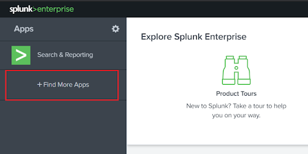

    2. Search for ***Splunk DB Connect***.
    3. Click on the ***Install*** button for the Splunk DB Connect app.  
    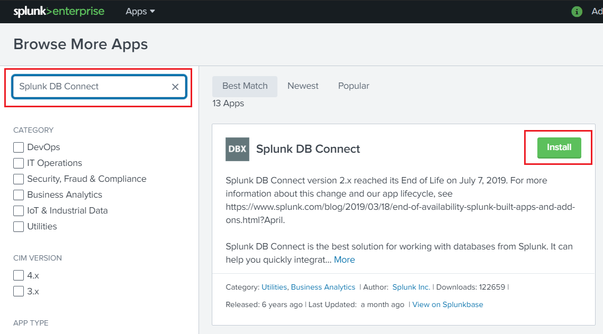

    4. Provide username and password for your splunk.com account, check the checkbox, and click on the ***Login and install*** button.
    5. Once installed, a "Restart Required" message will appear. Click on ***Restart Now***.
    6. After the restart, open the app and follow the instructions for [configuring the app](#Configuring%20Splunk%20DB%20Connect%20App).
2. Download from Splunkbase and install
    1. Download Splunk DB Connect app from Splunkbase ([https://splunkbase.splunk.com/app/2686/](https://splunkbase.splunk.com/app/2686/).
    2. Open Splunk UI and click on the ***gear icon*** on the top left side.  
    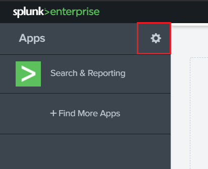

    3. Click on the ***Install app*** from the file in the top right corner.  
    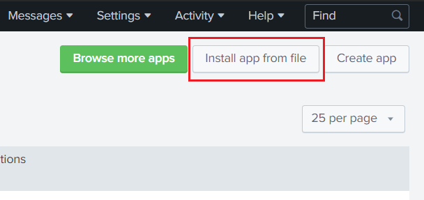

    4. Select the file you downloaded from Splunkbase and click ***Upload***.
    5. Once installed, a "Restart Required" message will appear. Click on ***Restart Now***.
    6. After the restart, open the app and follow the instructions for [configuring the app](#Configuring%20Splunk%20DB%20Connect%20App).

# Configuring Splunk DB Connect App

This topic explains how to setup DB Connect before you use it to access databases.

## General Tab

1. Navigate to the ***Splunk DB Connect app*** and in the Configuration tab, click on ***Settings***. 
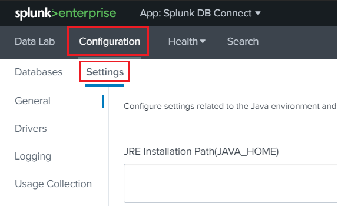

2. The General Settings tab contains settings related to your Java Runtime Environment (JRE) and Task Server. Change any settings you wish. When the DB Connect app prompts you to input the JRE Installation path, be sure to input the complete JRE file path.  
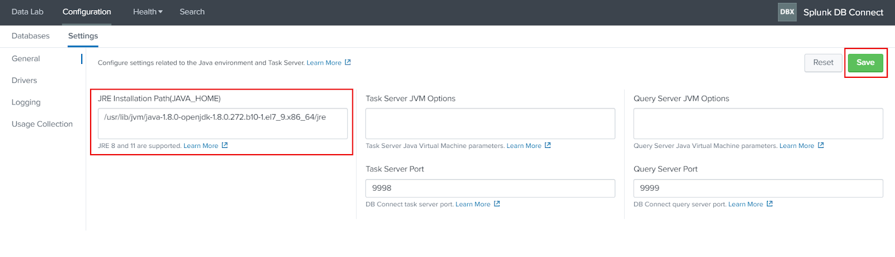

3. Click ***Save*** to restart the Task Server's Java process. You do not need to restart Splunk Enterprise for changes on this page to take effect. 

  **JRE Installation Path (JAVA_HOME)**
  
  DB Connect attempts to detect the `JAVA_HOME` environment variables as the JRE installation path if possible. You can change it to the Java path you want to use for DB Connect.    
    
  **Task Server Port**
  
  This field contains the port number of the task server. DB Connect uses an RPC server to manage communications with the Java subsystem. The default port is 9998, but you can use any unassigned, unused port on your system.

## Setup Driver

Download and install the JDBC Driver. Follow the steps below to setup the driver:

1. Configure Databricks JDBC Drivers:
  1. Download the JDBC Databricks driver ([download](https://pages.databricks.com/ODBC-Driver-Download.html))
  2. From the backend, place the `SparkJDBC42.jar` and `EULA.txt` (downloaded driver file and EULA file) to `$SPLUNK_HOME/etc/apps/splunk_app_db_connect/drivers` directory.
  3. From the backend, navigate to the `$SPLUNK_HOME/etc/apps/splunk_app_db_connect/local` directory and create a file named `db_connection_types.conf`, and add the following content in the file. (Create the local directory if not exists)

      ```
      [databricks_spark_sql]
      displayName = Databricks Spark SQL
      serviceClass = com.splunk.dbx2.SparkJDBC
      jdbcUrlFormat = jdbc:spark://<host>:<port>/<database>
      jdbcUrlSSLFormat = jdbc:spark://<host>:<port>/<database>?useSSL=true
      jdbcDriverClass = com.simba.spark.jdbc.Driver
      supportedVersions = 1.0
      port = 10000
      ui_default_catalog = $database$
      connection_properties = {"verifyServerCertificate":"false"}

      ```

  4. From the UI, navigate to ***Splunk DB Connect App > Configuration > Settings > Drivers*** and click on ***Reload*** button.
  5. A driver with the name, ***Databricks Spark SQL***, should be available and you should see a ***green checkmark*** followed by ***Yes*** in the ***Installed*** column against that driver.  
  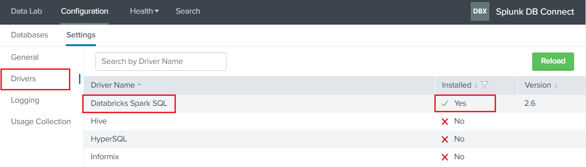

## Establish Connection to Databricks


### Create Identity in Splunk

1. From within Splunk DB Connect, navigate to the ***Configuration > Databases > Identities*** tab and click ***New Identity***.
2. Fill in the appropriate details:
    - **Identity Name:** Unique name of the identities
    - **Username**: Enter your Databricks Email/Username and password that you use for the Databricks instance that you want to connect to.       
    **Note**: Ensure that the database user has sufficient access to the data you want to search. For example, you might create a database user account whose access is limited to the data you want Splunk Enterprise to consume.
    - **Password**: Enter the password for the user you entered in the Username field.   
    **Note**: Your password is encrypted. DB Connect requires this field to connect to your database.  
3. Click ***Save***.  
4. Configure security and access control for your identities by referring to the Splunk DB Connect App [documentation](https://docs.splunk.com/Documentation/DBX/3.4.1/DeployDBX/Configuresecurityandaccesscontrols).

### Create a Database connection

To create a new connection:

1. From within Splunk DB Connect, navigate to the ***Configuration > Databases > Connections*** tab.
2. Click ***New Connection***.  
**Note**: If you have not yet created an identity, the New Identity window appears. Create a new identity, and then you can create a new connection.
3. On the New Connection page, and fill in the appropriate details:
    - **Connection name:** Unique name of the connection.
    - **Identity:** Choose the identity you want to use with this connection.
    - **Connection Type:** Select the configured spark driver.
    - **Timezone:** Select your timezone.    
4. JDBC URL Settings:
    - Check the ,Edit JDBC URL, and paste the JDBC URL.
    - You can get the JDBC URL from Databricks Instance by following the below-mentioned steps:
      - Navigate to your **Databricks instance > Cluster > your-cluster-name > Advanced Options > JDBC/ODBC*** tab.
      - For more, refer to the doc
  [https://docs.databricks.com/integrations/bi/jdbc-odbc-bi.html#step-2-collect-jdbc-or-odbc-connection-information](https://docs.databricks.com/integrations/bi/jdbc-odbc-bi.html#step-2-collect-jdbc-or-odbc-connection-information)
    - Get the JDBC URL in the below form.
      - `jdbc:spark://<host-name>:<port>/<database>;transportMode=<transport-mode>;ssl=1;httpPath=<http-path>;UserAgentEntry=Databricks-Splunk-DBConnect-JDBC`  
      
      **Note:** Don't include the `AuthMech`, `UID`, and `PWD` parameters. DB Connect supports LDAP connection, you need to specify the LDAP URL in the JDBC URL field. Consult your database vendor's documentation on how to generate LDAP URLs.  
      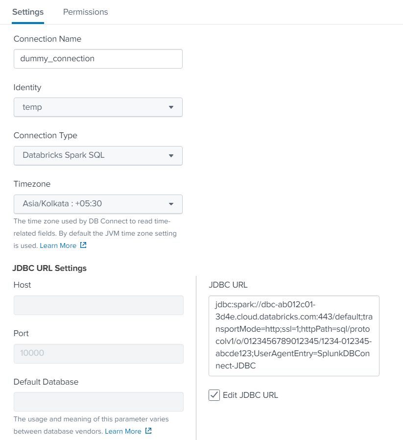

5. Advanced Settings:
  - **Fetch Size (Optional)**: Enter the number of rows to return at a time from the database. If you leave this field blank, it defaults to 300.
  - **Readonly**: Select this checkbox to indicate your intention for users to only use SELECT statements with the database. Be aware that this cannot always guarantee read-only access. DB Connect will do its best to ensure that no changes are made, but it is the database driver that ultimately allows or prevents changes. If you intend to use the read-only option, ensure that, on the database itself, the user you're connecting to is limited to read-only access.
6. Click ***Save*** to save the connection.  
**Note**: If the connection you create is valid, you can save the connection successfully. Otherwise, the error message will prompt up, you need to check the configuration of the connection and save it again.
7. Configure security and access control for your connection by referring to the Splunk DB Connect App [documentation](https://docs.splunk.com/Documentation/DBX/3.4.1/DeployDBX/Configuresecurityandaccesscontrols).

## Restricting Access To Users

To restrict access of the identities and connections among the users, the admin needs to create a custom role with certain capabilities, create a user with a newly created role, and create identities and connections with access limited to that particular user.

### Create a custom role with limited privileges

1. From within the Splunk, navigate to the ***Settings > Roles***.
2. On the top right corner, click on the ***New Role***.
3. Provide name "Databricks-User" and under the Inheritance tab, check the `db_connect_user`.
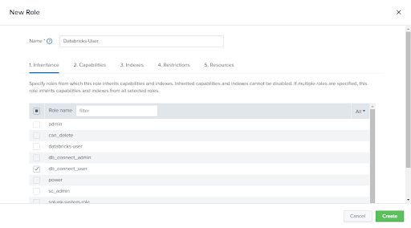

4. Under the Capabilities tab, select the following capabilities:
    - `db_connect_create_identity`
    - `db_connect_delete_identity`
    - `db_connect_update_identity`
    - `db_connect_create_connection`
    - `db_connect_delete_connection`
    - `db_connect_edit_connection_ssl`
    - `db_connect_update_connection  `
    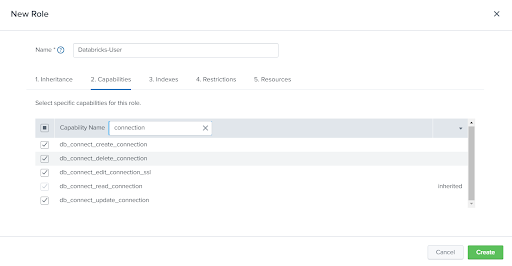

5. Click on ***Create*** and check if the newly created role has been added.  
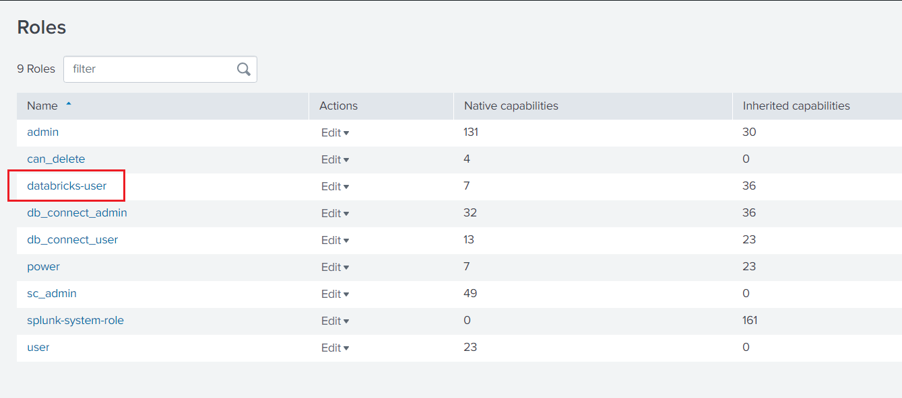

### Create a user with the Databricks-User role

1. From within the Splunk, navigate to the ***Settings > Users***.
2. On the top right corner, click on the ***New User***.
3. Provide a name and password with the appropriate time zone.
4. In the Assign roles section, select ***Databricks-User***.
5. Select the ***Create a role for this user*** box.
6. Select the ***Require password change on first login*** if required. 
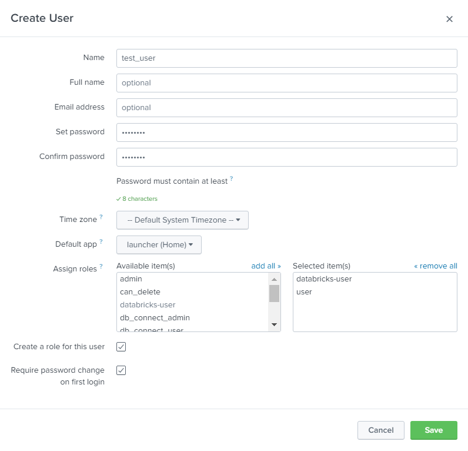

7. Click on ***save*** and validate if the newly created user has been added.  
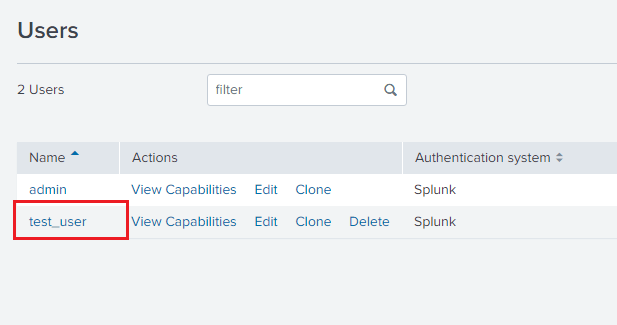

### Limit the access of identities and connection to particular users

1. From within the Splunk, navigate to the ***Splunk DB Connect App***.
2. Navigate to the ***Databases > Identities***.
3. Click on ***New Identity*** to create a new identity.
4. Under the ***Settings*** tab, fill the fields with dummy values as only an admin is able to create a connection or identity. Later, users with the role of ***Databricks-User*** can update the already created connection or identity with real values.  
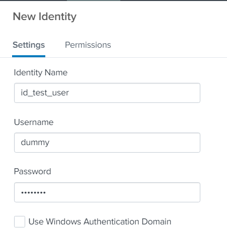

5. Under the Permission tab, uncheck the read permission from db_connect_user and check the read and write permissions to the newly created user-based role.  
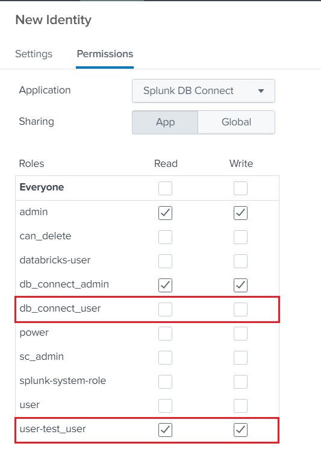

6. Click on ***save***.
7. Repeat the same steps to create a connection by providing dummy values under the Settings tab and grant the same permission as above in the Permission tab.  
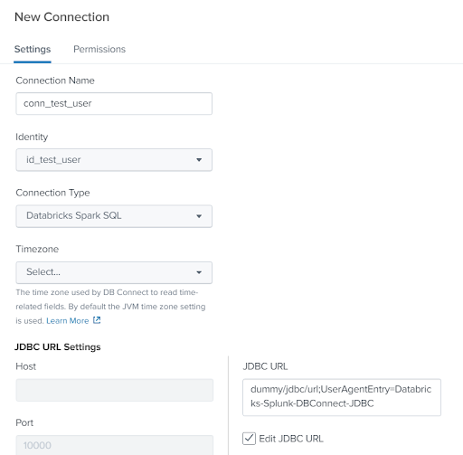

8. While creating the connection, since the provided details are dummy, it will give the error message saying "Database connection is invalid".
9. Click on ***Save Anyways*** and the connection with dummy values will be created.  
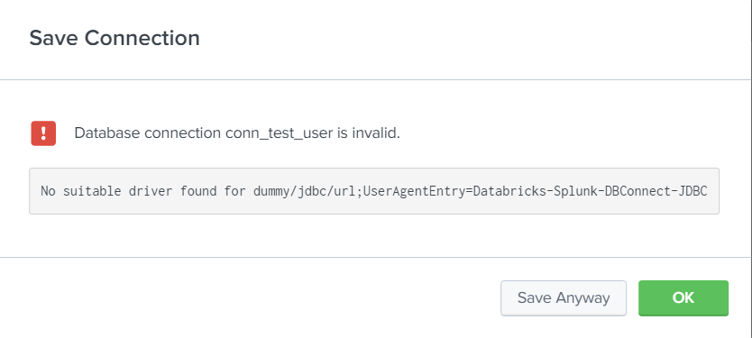

Repeat [section 2](#Create%20a%20user%20with%20the%20Databricks-User%20role) (create a user) and [section 3](#Limit%20the%20access%20of%20identities%20and%20connection%20to%20particular%20users) (limit the access) for each new user. The new user will be able to sign in to Splunk with the username and password provided in section 2. Once logged in, all they need to do is edit the existing created connection and identity, and they will be able to use the app.

# Validate the connection

Validate your connections with your query data.

- From within Splunk DB Connect, navigate to the ***Data Lab > SQL Explorer*** and Select the connection, and hit your query.

OR

- Run the below command in Splunk

    `| dbxquery query="<your-query>" connection="<connection-name>"`

# Troubleshooting

- "Cannot communicate with task server, please check your settings."
  - Validate that the JAVA_HOME path is set correctly and the provided port is not used by any other service. You can change the port and try saving again. You may need to restart your Splunk.
- For any other errors, you can refer to the Splunk DB Connect App [troubleshooting documentation](https://docs.splunk.com/Documentation/DBX/3.4.1/DeployDBX/Troubleshooting).

# References

- [https://docs.splunk.com/Documentation/DBX/3.4.1/DeployDBX/AboutSplunkDBConnect](https://docs.splunk.com/Documentation/DBX/3.4.1/DeployDBX/AboutSplunkDBConnect)
